# Sesión 01: Introducción a los contenedores en ECS: EC2 y fargate

## Introducción

En ésta primer sesión de work pondremos en práctica los conceptos del funcionamiento de los
contenedores y docker aprendidos durante el prework, mostraremos como construir una aplicación
web dentro de un contenedor y desplegarlo usando los servicios de nube de AWS.

### Objetivos

Los objetivos especificos para el work de esta sesión son:

* Practicar con Docker
* Comprender el funcionamiento de los contenedores en la nube
* Descubrir el servicio ECS y sus componentes
* Lanzar un web service completamente administrador desde una imagen almacenada en ECR

## Requisitos

Para poder realizar las siguientes actividades es necesario lo siguiente:

* Una computador con acceso a Internet
* Una cuenta de usuario de AWS
* Permisos de acceso para usar los servicios:
  * AWS Cloud9
  * AWS ECR
  * AWS ECS

## Actividades

En esta sesión realizaremos las siguientes actividades:

* Haciendo un Hello world desde un contenedor
* Interactuamos con los contenedores en el shell
* Exponer un contenedor para consumirlo en la red
* Crear una imagen de contenedor desde un entorno AWS Cloud9
* Crear un repositorio de imágenes de contenedor en AWS ECR
* Publicar una imagen de contenedor en repositorio ECR
* Desplegar una imagen de contenedor en Clúster AWS ECS

#### Hello from Docker

En esta actividad realizaremos ejercicios para aprender a usar el clásico `hello wold` dentro
de un contenedor docker.

Usaremos un entorno de desarrollo en AWS Cloud9 para simplificar el uso de docker en un ambiente ya
pre configurado.

Debemos ir al módulo `AWS Cloud9`, y hacemos clic en `Crear Entorno`, nombramos el entorno usando
un distintivo especifico para tu proyecto.

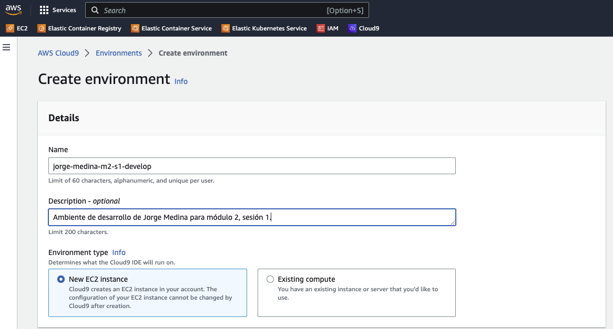

En el tipo de entorno usaremos `New EC2 instance` para usar una instancia EC2 del tipo `e2-micro`
la cual esta dentro del `free tier`. Usaremos `Amazon Linux 2` como la plataforma donde correrá
el entorno de desarrollo cloud9.

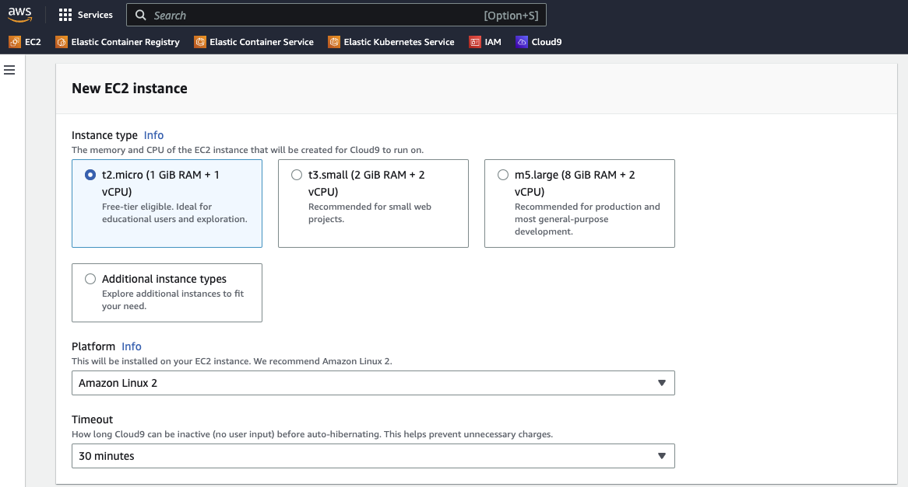

En las opciones de red usamos la opción `AWS System Manager (SSM)` para el tipo de conexión con
el entorno, y las opciones predeterminadas para crear el ambiente en el VPC predeterminado y sin
ninguna preferencia sobre la subred que usaremos.

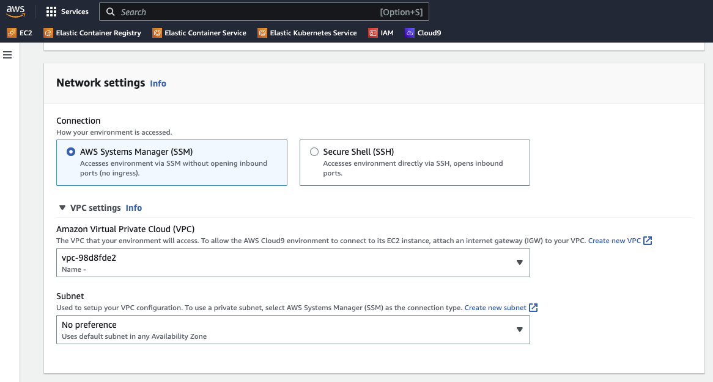

Para las etiquetas de este recurso se recomienda usar:

* owner: email
* environment: development
* cost-center: bam

Esperamos a que se aprovisionen los recursos de Cloud9, hacemos clic en el nombre de nuestro entorno
para ver los detalles.

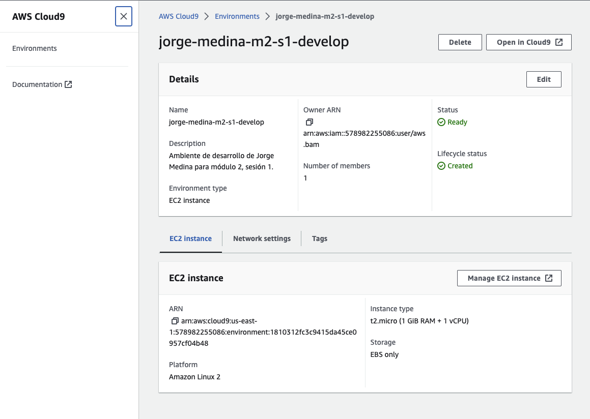

Una vez que se ha creado el entorno cloud9, hacemos clic en `Open in Cloud9` para abrir el URl con
el entorno de desarrollo web.

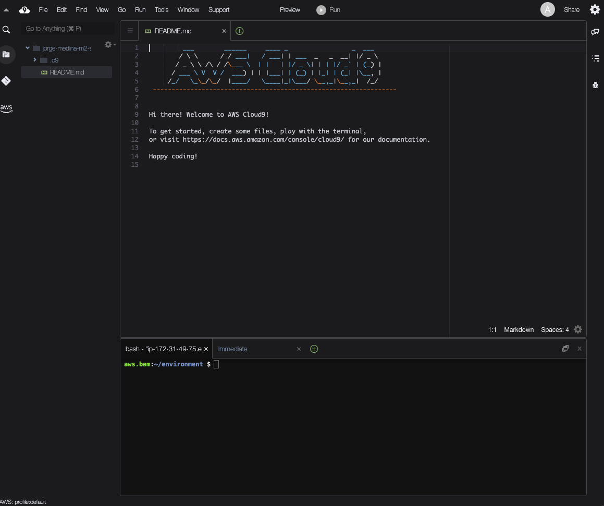

En `Cloud9`, vamos a la `Terminal` y ahi hacemos las siguientes validaciones para ver que ya tengamos
docker configurado y listo para usarse.

Verificamos la ruta donde esta instalado docker con el comando `which`:

```shell
$ which docker
```

Usando el comando `id` vusuario sea miembro del grupo de sistema `docker`:

```shell
$ id
```

Verificamos que nos podamos conectar con el cliente docker al servidor o demonio Docker.

```shell
$ docker info
```

Ahora si, usamos el comando `docker run` para ejecutar una aplicación dentro de un contenedor,

```shell
$ docker run hello-world
```

Ahora usamos el comando `docker ps` para listar los contenedores:

```shell
$ docker ps -a
```

La opción `-a` lista todos los contenedores, los que ya terminaron su ejecución y los que están
activos.

Finalmente, usamos el comando `docker images` paral listar las imágenes de los contenedores que hemos descargado:

```shell
$ docker images
```

#### Interactúa con un contenedor

Ahora vamos a ver una forma diferente de ejecutar un conteneedor en la cual pasamos un parámetro
a su ejecución, por ejemplo:

```shell
$ docker run busybox echo "hello from busybox"
```

El comando anterior ejecuta un contenedor usando la imágen de busybox, el cual es un sistema
Linux reducido que tiene comandos básicos del sistema, en este caso se le pasa el parámetro
en donde se le dice que use el comando `echo` para que imprima un mensaje personalizado.

Ahora usamos el siguiente comando para listar los contenedores que hemos ejecutado:

```shell
$ docker ps -a
```

Ejecutamos un nuevo contenedor busybox pero con un mensaje diferente:

```shell
$ docker run busybox echo "Hola BEDU"
```

Veamos que pasa con los contenedores en el listado:

```shell
$ docker ps -a
```

Ejecutemos un contenedor con `busybox` y nos conectamos a su shell:

```shell
$ docker run -it busybox sh
```

La opción `-it` solicita una pseudoTTY para interacturar con el shell `sh`, el cual
se pasa como parámetro a la ejecución del contenedor.

Dentro del shell del contenedor busybox hacemos un listado rápido y salimos:

```shell
$ ls
$ cd bin
$ ls
$ exit
```

#### Exposición de un contenedor

En esta actividad mostraremos como exponer un contenedor de manera que pueda ser consumido en la red.

Primero debemos hacer un listado de las imágenes locales para saber cuales hemos descargado:

```shell
$ docker images
```

Ahora descargamos la imagen de el servidor web `nginx` desde un repositorio o registry de imágenes:

```shell
$ docker pull nginx
```

Listamos nuevamente las imagenes:

```shell
$ docker images
```

Como podemos ver ya tenemos la imagen de `nginx` en local lista para usarse.

Para ejecutar un contenedor usando una imagen recien descargada usamos `docker run`, por ejemplo:

```shell
$ docker run --rm -it nginx
```

Describimos las opciones usadas en el comando de arriba:

* **--rm**: especifica que se limpie el contenedor después de que el comando salga.
* **-it**: especifica que se abra un pseudoTTY con stdin.

En Cloud9 crea una nueva terminal y listemos los contenedores para
ver el estado de el servicio que acabamos de ejecutar:

```shell
$ docker ps -a
```

Como se puede ver, en este caso el contenedor de nginx esta con un estado de `UP` y expone un servicio en el puerto `TCP/80`.

Este contenedor se ejecuta en primer plano, para cancelar su ejecución, use `Ctrl+C`.

Ahora ejecutamos el contenedor en segundo plano con un mapeo de puertos dinámico y con un nombre de contenedor
personalizado:

```shell
$ docker run -d -P --name miweb nginx
```

En este ejercicio se usa la opción `-P` la cual sirve para publicar todos los puertos expuestos hacia puertos aleatorios.

Listamos los contenedores para identificar el puerto al que se mapeo el servicio:

```shell
$ docker ps
```

Hacemos una solicitud web usando el cliente `curl` en el `localhost` y el puerto `49153`:

```shell
$ curl http://localhost:49153
```

Ahora detenemos la ejecución del contenedor usando su nombre personalizado:

```shell
$ docker stop miweb
```

Ahora veremos como ejecutar un contenedor usando un mapeo de puertos estático:

```shell
$ docker run -p 8888:80 nginx
```

En este ejercicio se usa la opción `-p` para hacer un mapeo estático de los puertos de red
del contenedor y en el que se expondrá en la red.

#### Creación de imagen de contenedor

Para los ejercicios de esta actividad vamos a usar el proyecto de `docker-curriculum` el cual incluye
código que nos puede ayudar a realizar nuestras prácticas de docker de forma sencilla, este proyecto
permite construir dos tipos de contenedores, uno para un sitio web estático y otro para una aplicación
web con el framework de desarrollo web Flask.

Para los ejercicios de esta sesión construiremos la versión de la aplicación web Flask, así que lo
primero que debemos hacer es, desde nuestro entorno de trabajo Cloud9 vamos a la terminal y clonamos
el repositorio de github:

```shell
$ git clone https://github.com/prakhar1989/docker-curriculum.git
```

Entramos al directorio del proyecto de la aplicación flask:

```shell
$ cd docker-curriculum/flask-app
```

Los archivos relevantes para esta sesión son los siguientes:

* **app.py** - Programa principal python.
* **requirements.txt** - Definición de dependencias para aplicación python.
* **Dockerfile** - Instrucciones para construir imagen de contendor docker

Mostramos el contenido del archivo Dockerfile para ver lo que vamos a construir:

```shell
$ cat Dockerfile
```

Antes de empezar a crear la imagen definamos su nombre en una variable de entorno del shell
para poder reutilizarlo en los siguientes pasos:

```shell
$ export IMAGE_NAME=jmedina/miapp
```

Construimos la imagen y le asignamos un nombre o etiqueta personalizada:

```shell
$ docker build -t $IMAGE_NAME .
```

Una vez que termina el proceso de construcción de la imagen hacemos un listado para verificarlo:

```shell
$ docker images
```

Como se puede ver ya tenemos una imagen local con el nombre `$IMAGE_NAME`.

Ejecutemos un contenedor en local usando la nueva imagen:

```shell
$ docker run -d -P --name miapp $IMAGE_NAME
```

Listamos los contenedores para validar.

#### Creación de repositorio

Para crear un nuevo repositorio vamos al módulo de ECR y hacemos clic en `Crear repositorio`,
en las opciones de `Configuración General` lo primero que debemos configurar es el tipo de
visibilidad, para estos ejercicios usaremos sólo el tipo `Privado`.

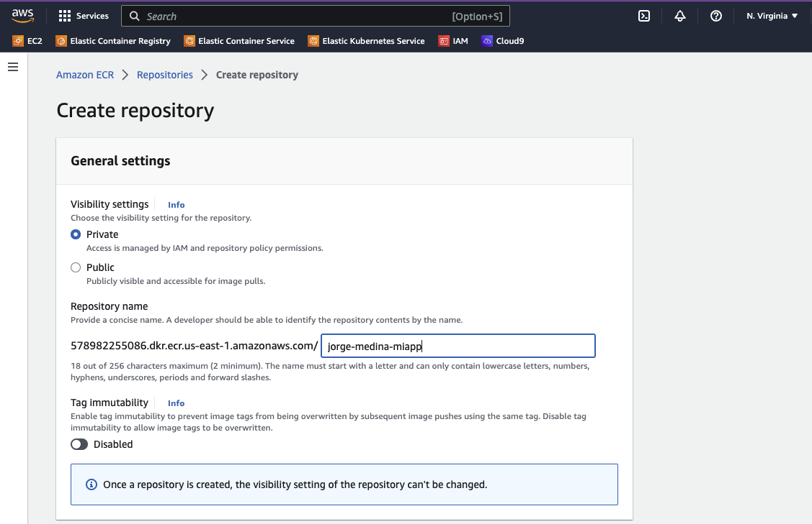

Se recomienda que el nombre del repositorio esté asociado al proyecto, que se escriba en minusculas,
de preferencia una sola palabra, si son más se separan por guión medio `-`.

Listamos nuestro nuevo repositorio para ver los detalles:

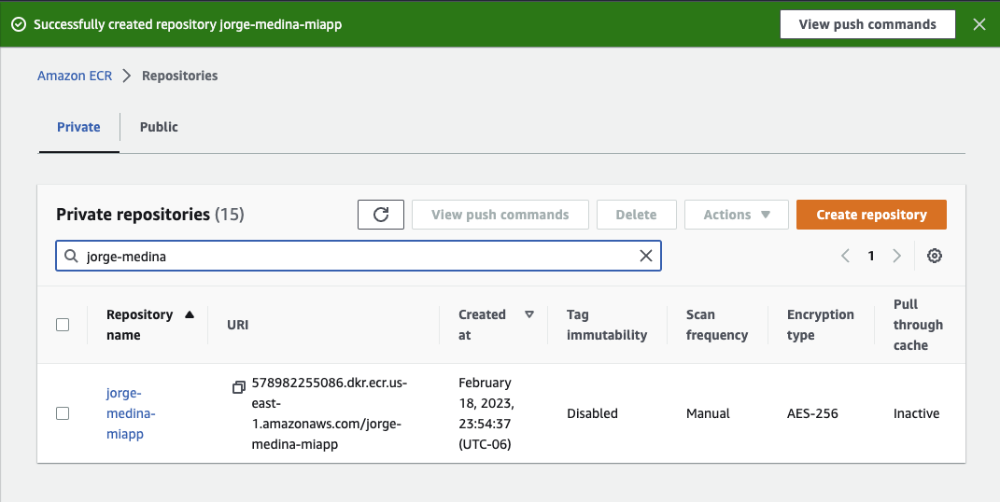

Cuando se crea el repositorio le muestra el nombre y el URI, copie ambos para que los podamos reusar
en los siguientes pasos.

* Nombre repositorio: jorge-medina-miapp
* URI repositorio: 578982255086.dkr.ecr.us-east-1.amazonaws.com/jorge-medina-miapp

Además de los datos que arriba se mencionan, es importante saber que en los pasos siguientes también
se va a necesitar el nombre de la región donde se creó el repositorio, para este ejercicio usamos:

* Región repositorio: us-east-1

Definamos las siguientes variables de entorno con los datos recién obtenidos:

```shell
$ export REPO_NAME=jorge-medina-miapp
$ export REPO_URI=578982255086.dkr.ecr.us-east-1.amazonaws.com/jorge-medina-miapp
$ export REPO_REGION=us-east-1
```

En los siguientes pasos reutilizaremos los valores asignados a estas variables.

#### Publicación de imagen en repositorio

Una vez que el repositorio está listo en AWS ECR es momento de realizar el proceso de publicación
de la imagen que hemos construído.

En Cloud9, vamos al directorio donde tenemos el archivo Dockerfile del proyecto, ahí debemos
ejecutar un comando que nos obtendrá las credenciales de acceso al repositorio ECR y las pasará
a docker para que haga login y podamos escribir imagenes en el repositorio.

```shell
$ cd docker-curriculum/flask-app
$ aws ecr get-login-password --region $REPO_REGION | docker login --username AWS --password-stdin $REPO_URI
```

**IMPORTANTE:** El comando de `aws ecr` necesita que se pase la región en la que se creó el repositorio.

**IMPORTANTE:** El comando de `docker login` necesita que se pase el URI del repositorio.

Antes de publicar la imágen al repositorio remoto, hacemos un listado de las imágenes locales:

```shell
$ docker images
```

Ahora si ejecutamos la tarea que publica la imágen en el repositorio ECR:

```shell
$ docker tag $IMAGE_NAME:latest $REPO_URI
$ docker push $REPO_URI
```

Si el proceso de hacer push de la imágen hacía el repositorio ECR es éxitoso, entonces deberá de
aparecer la imágen listada similar a esto:

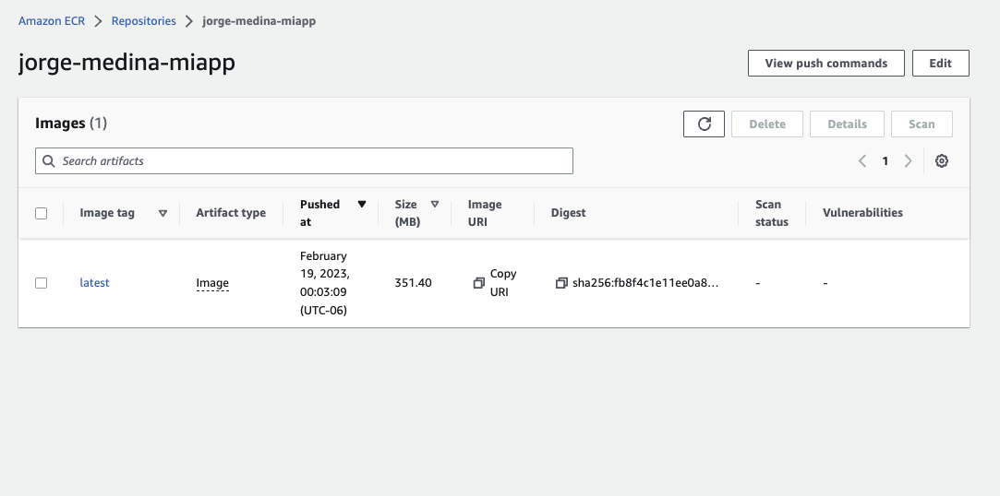

Ahora que la imágen de la versión `latest` ha sido publicada en el repositorio, es importante que
anotemos el URI de la imágen ya que en el siguiente pasó será usada.

* URI de imágen: 578982255086.dkr.ecr.us-east-1.amazonaws.com/jorge-medina-miapp:latest

Exportamos la variable de entorno IMAGE_URI:

```shell
$ export IMAGE_URI=578982255086.dkr.ecr.us-east-1.amazonaws.com/jorge-medina-miapp:latest
```

### Construir un Clúster ECS

En esta actividad vamos a realizar las siguientes tareas:

* Crear un clúster ECS
* Crear una definición de tarea
* Crear un servicio
* Permitir el acceso al servicio
* Validar el servicio

#### Crear un clúster ECS

Para crear un nuevo cluster vamos al módulo `ECS` y hacemos clic en `Crear clúster`, asignamos un nombre que este
asociado al owner y la aplicación, y en la parte de las configuración de red, usamos los parámetros predefinidos
para la VPC y subredes, en la parte del namespace usamos `jorge-medina-miapp`, por ejemplo:

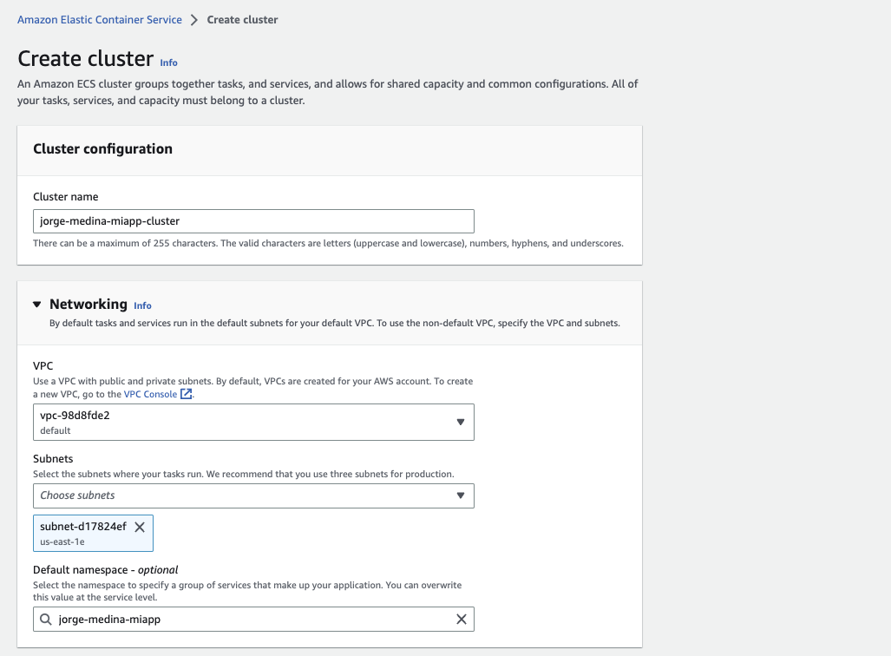o

En las opciones de infraestructura usaremos la basada en `AWS Fargate (serverless)` y en la parte de monitoreo
usaremos los valores predefinidos por ahora.

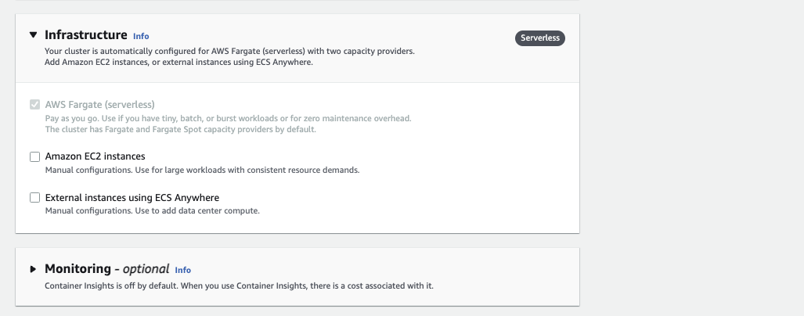o

Después de que se ha creado el cluster, hacemos clic en el listado para ver sus detalles:

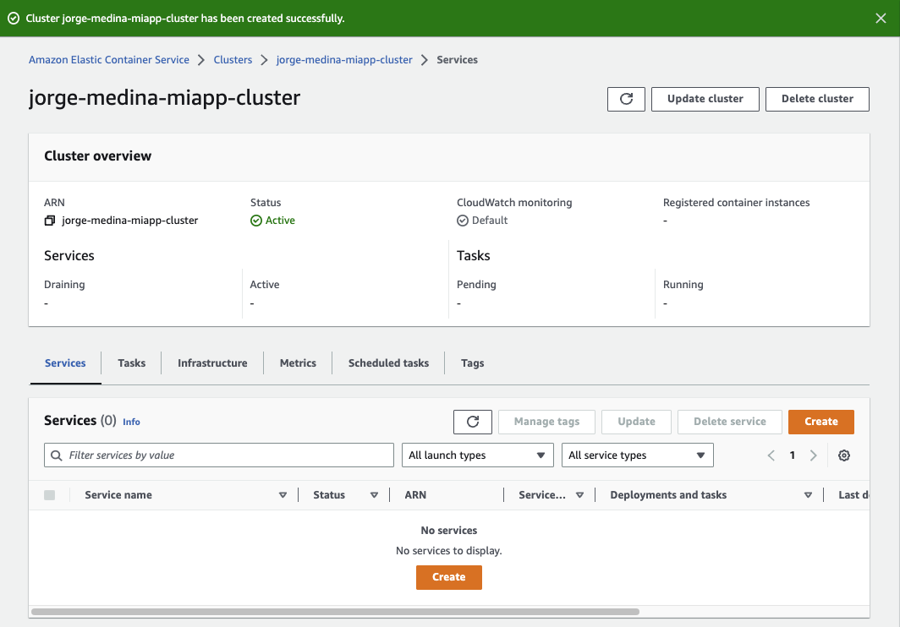

#### Crear una definición de tarea

Ya que hemos creado el clúster ECS, ahora vamos al menú de la izquierda de `Task definitions`, ahí hacemos
clic en el botón `Create new task definition`, se define el nombre de la definición de tarea.  En las opciones
de Container definimos el nombre del repositorio y el URI de la imagen, usando `Essential container`.

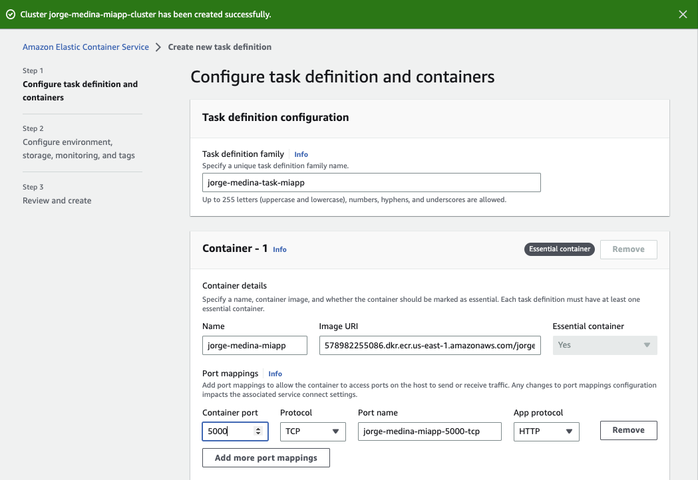

En las opciones de entorno usamos `AWS Fargate (serverless)` en el `App environment`, en la arquitectura del
sistema operativo usamos `Linux/X86_64` con `1 vCPU` y `3 GB` de memoria. En las opciones de `Task role` y 
`Task execution role` usamos el valor `ecsTaskExecutionRole`.

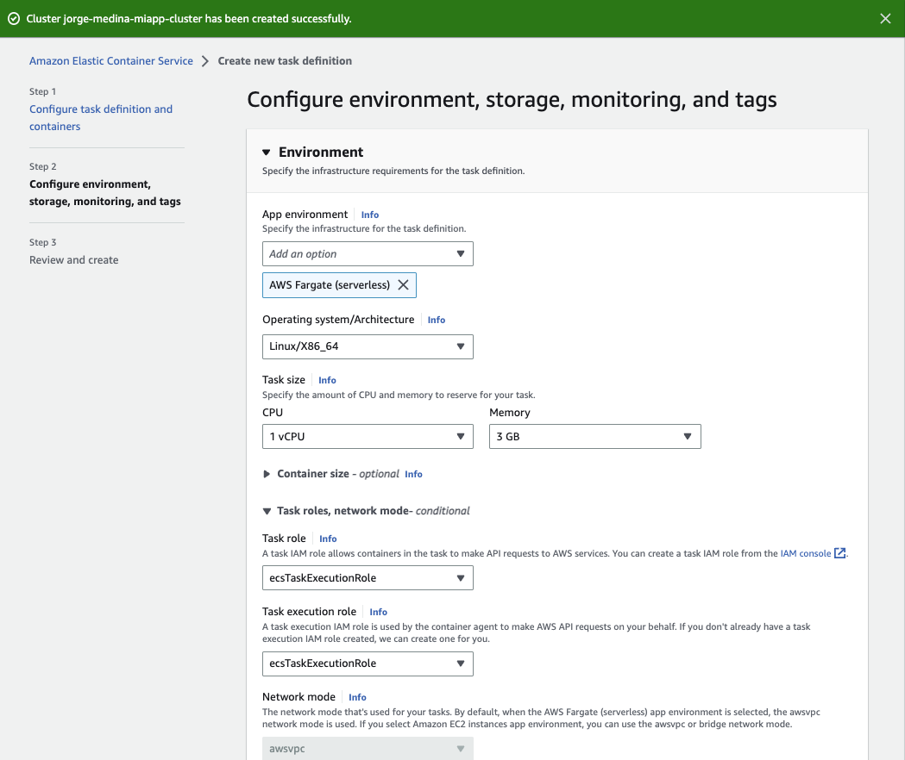

En las opcioens restantes usamos los parámetros predefinidos, al final el task definition queda así:

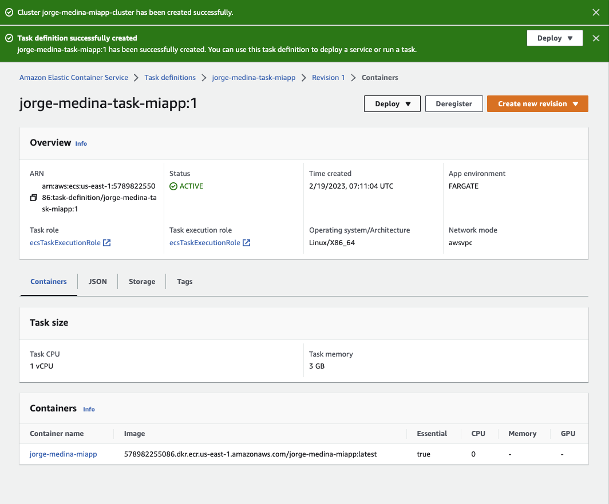

#### Crear un servicio

Una vez que hemos creado la definición de la tarea en el cluster debemos hacer la implementación
como un servicio, selecionamos el nombre del servicio que arriba creamos, y luego se debe hacer clic
en el botón `Implementar` y selección `Crear servicio`.

Se debe elegir un cluster existente en donde se creará el sevicio y en las opciones de la configuración
de cómputo, usamos `Capacity provider strategy`, y luego usamos la opción `Use custom (Advanced)` con el
capacity provider `FARGATE` con `0` de base y `1` de peso y  finalmente, usamos la última versión de la
plataforma.

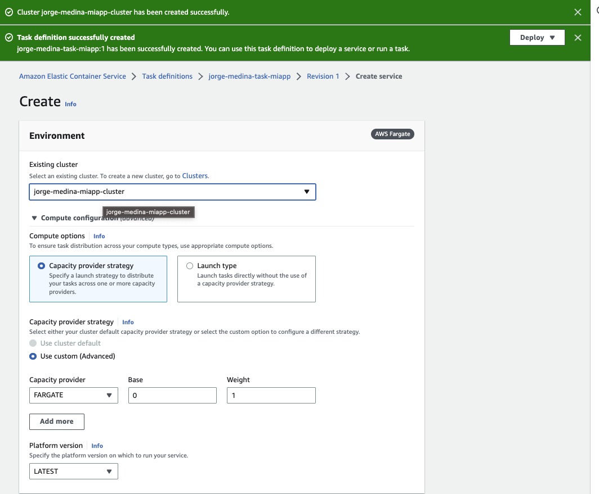

En las configuraciones de el despliegue seleccionamos el tipo de aplicación `Service`, y ponemos el nombre
del servicio, el tipo es `Replica` y ponemos en tareas deseadas `1`.

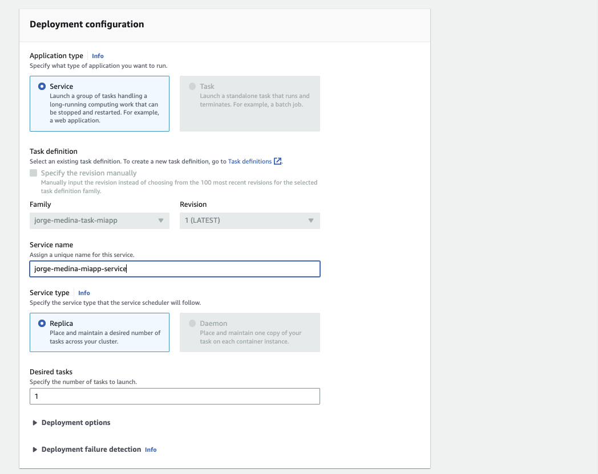

En las opciones de `Service connect`, `Networking` y `Service auto scaling` usamos los parámetros predefinidos.

Para las etiquetas de este recurso se recomienda usar:

* owner: email
* environment: development
* cost-center: bam

Una vez que se ha creado el servicio, así aparece en la lista:


Hagamos clic en `Tasks`, seleccionamos nuestro task y luego vamos al tab de `Networking` podemos localizar
la dirección IP por la que se expone el servicio:

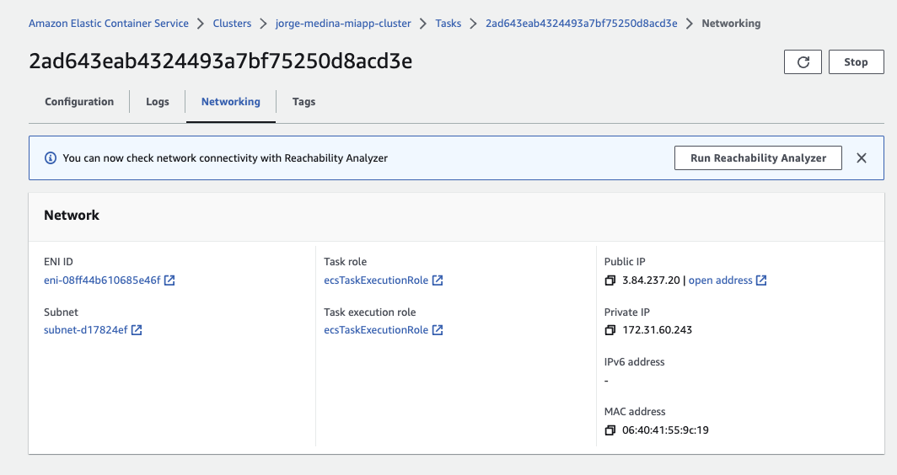

#### Dar acceso al servicio

Por default, el servidor donde se ejecuta la carga de trabajo que acabamos de dar de alta solo
permite el acceso desde el mismo VPC, por lo que si se intenta acceder al servicio usando
la IP publica asociada a la tarea desde nuestra conexión de casa no podrémos entrar.

Debe editar el security group asociado a la red donde se desplegó el cluster y agregar una regla
de entrada que permita el acceso al servicio en el puerto `TCP/5000` a un origen definido.

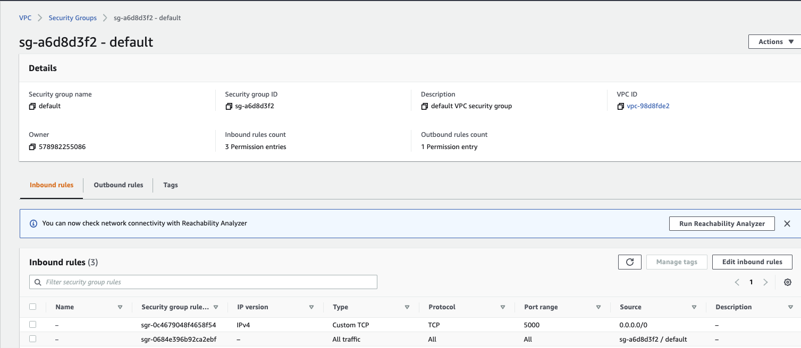

**IMPORTANTE:** En este caso, la regla permite la entrada con origen `0.0.0.0/0`.

#### Validación

Después que se creó el definition task, el servicio y de que se dió el acceso en el security group
debemos obtener la dirección IP donde se publica el servicio.

Para esto vamos a el cluster, luego en las tareas, seleccionamos la tearea que definimos y luego
vamos a la pestaña `Redes` en donde aparece la dirección IP Externa por la que se puede acceder
el servicio.

**NOTA:** Recuerda que la definición de la tarea se uso el mapeo del puerto 5000, por lo que debes
agregarlo al final del URL, por ejemplo: http://3.84.237.20:5000.

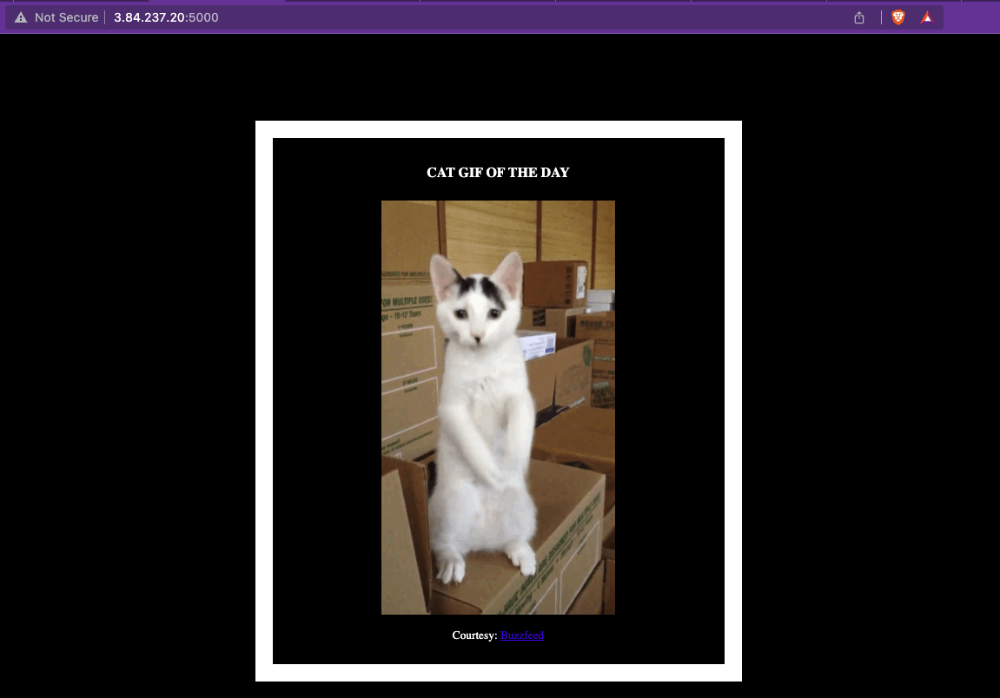

## Limpieza

Es sumamente importante señalar que después de que hemos realizado la actividad de la sesión
y hemos terminado de usar los recursos cloud que creamos es nuestra responsabilidad hacer
una limpieza de los recursos utilizados para no incurrir en más gastos en la cuenta AWS, por
lo que recomendados hacer una limpieza de los recursos.

Para la limpieza se debe de hacer en el orden reverso a como se crearon los recursos:

* Eliminar definición de servicio en clúster ECS
* Eliminar definición de tarea en clúster ECS
* Eliminar clúster ECS
* Eliminar repositorio ECR
* Eliminar entorno Cloud9

## Referencias

La siguiente es una lista de referencias que pueden usar para complementar
lo que se expone en esta sesión.

* [Qué es Docker?](https://aws.amazon.com/es/docker/)
* [Dockerhub](https://hub.docker.com/)
* [Docker Curriculum website](https://docker-curriculum.com/)
* [Docker Curriculum repository](https://github.com/prakhar1989/docker-curriculum)
* [Amazon Elastic Container Service (Amazon ECS)](https://aws.amazon.com/es/ecs/)
* [Características de Amazon Elastic Container Service](https://aws.amazon.com/es/ecs/features/)
* [Introducción a Amazon Elastic Container Service](https://aws.amazon.com/es/ecs/getting-started/)
* [Creación de una imagen de contenedor para utilizarla en Amazon ECS](https://docs.aws.amazon.com/es_es/AmazonECS/latest/userguide/create-container-image.html)