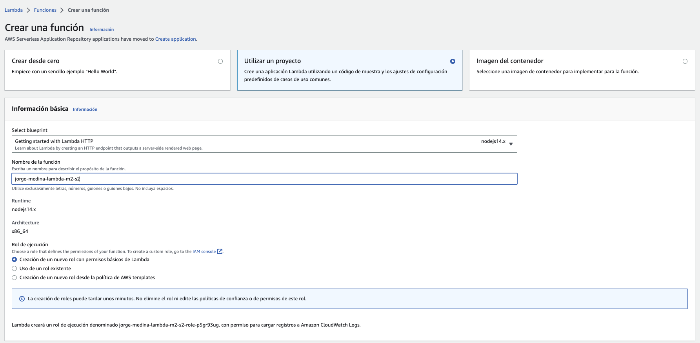
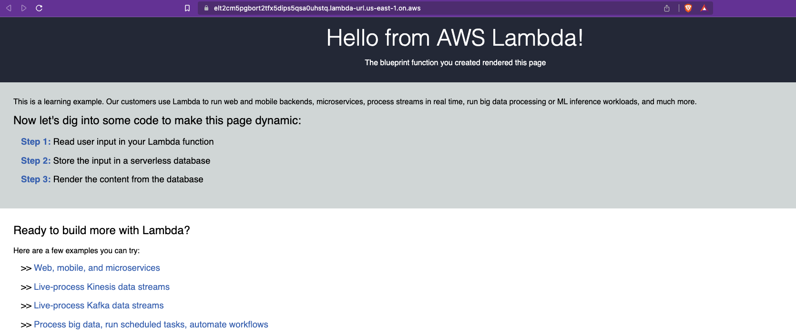

# Sesión 02: Serverless vs contenerización

## Introducción

En esta segunda sesión de work pondremos en práctica los diferentes arquitecturas para
entender mejor los servicios de tipo serverless, los contenedores y los principios de
los microservicios y desplegarlos usando los servicios de nube de AWS.

### Objetivos

Los objetivos especificos para el work de esta sesión son:

* Diferenciar entre los tipos de arquitectura
* Identificar sus ventajas y desventajas
* Analizar casos de uso de cada tipo de arquitectura

## Requisitos

Para poder realizar las siguientes actividades es necesario lo siguiente:

* Una computador con acceso a Internet
* Una cuenta de usuario de AWS
* Permisos de acceso para usar los servicios:
  * AWS Cloud9
  * AWS Cloudformation
  * AWS Lambda
  * AWS S3
  * AWS API Gateway
  * AWS DynamoDB
  * AWS Cloudwatch

Una vez que se ha creado el entorno cloud9, hacemos clic en `Open in Cloud9` para abrir el URl con
el entorno de desarrollo web.

En `Cloud9`, vamos a la `Terminal` y ahi hacemos las siguientes validaciones para ver que ya tengamos
docker configurado y listo para usarse.

## Actividades

En esta sesión realizaremos las siguientes actividades:

* Crearemos una Función como Servicio (FaaS) usando AWS Lambda
* Crear un bucket s3
* Exponer una API con API Gateway

### Crear función lambda con endpoint público

En esta actividad realizaremos un ejercicio donde crearemos una función HTTP como servicio usando AWS Lambda.

#### Ejecución

Para crear una función vamos al módulo de `Lambda` y hacemos clic en el botón `Crear una función`.
Usamos la opción de `Utilizar un proyecto` y luego en información básica, en `Select blueprint` elegimos `Getting started with Lambda HTTP` basado en `nodejs14.x`, asignamos un nombre para la función y definimos un nuevo rol para la función.

Después de la información básica se muestra el código de la función y después nos informa acerca del
endpoint público que se va a crear y advierte sobre los controles de accesos.

Y finalmente debemos hacer check en `Reconocimiento` para aceptar que la función se hará publica y sobre la facturación,
hacemos clic en `Crear una función` para que se inicie el aprovisionamiento.

#### Validación

Después de haber creado la función podremos ver la información generl de la función incluyendo el
`URL de la función`.

Abrimos en nuestro navegador el URL para verificar que el servicio esta accesible.

### Crear bucket de S3

En esta actividad realizaremos un ejercicio donde crearemos un bucket de almacenamiento de objetos
usando el servicio S3 de AWS.

#### Ejecución

Para crear un bucket vamos al módulo de `S3` y hacemos clic en el botón `Crear bucket`. En la
configuración general debemos elegir un nombre único y se elige la región en donde se desea
hospedar el bucket.

Después en las opciones de propiedad de objetos, se debe usar la opción recomendada de `ACL deshabilitadas`.

En la `configuración de bloque de acceso público para este bucket`, debemos quitar el check de la opción
`Bloquear todo el acceso público. Se debe hacer check en la opción de `Reconozco que la configuración
actual puede provocar que este bucket y los objetos que contiene se vuelvan públicos`.

En las opciones de `control de versiones de buckets` por ahora lo dejamos en `Desactivar`.

Y finalmente en las opciones de `cifrado predeterminado` dejamos en `tipo de clave de cifrado` la
opción de `Claves administradas por Amazon S3 (SSE-S3)`, y en `Clave de bucket` lo dejamos en
`Habilitar`.

Para finalizar hacemos clic en `Crear bucket`.

Después de haber creado el bucket, vamos a subir el archivo de `logo.png` que descargamos en las
actividades de prework, hacemos clic en el nombre del bucket, y luego en la pestaña de `Objetos`
hacemos clic en el botón `Cargar` y en `Agregar archivos` buscamos el archivo en nuestra
máquina.

Al final nos confirma de la carga y hacemos clic en `Cerrar`:

Ahora, hacemos clic en el archivo `logo.png` y luego hacemos clic en `Acciones de objetos`
y selecionamos la opción de `Compartir con una URL prefirmada`.

#### Validación

El proceso de arriba nos dará un URL el cual podemos acceder desde el botón `Abrir`.

### Exponer un servicio API

En esta actividad realizaremos un ejercicio donde 

usaremos

API Gateway
DynamoDB

#### Ejecución

Usaremos CloudFormation para aprovisionar la infraestructura y servicios necesarios para
nuestra aplicación serverless.

index.js
stack.yaml

TODO: imagen de arquitectura

Lambda

API LAMBDA BEDU

zip
Nodejs 12.x

DynamoDB

Creación de tabla user_id

API Gateway

Pruebas

Despliegue

Implementar la API

etapa de implementación prod
descripción de implementación prod

Monitoreo

Panel API Gateway

- Count:sum
- 5XXError:sum
- 4XXError:sum
- Latency: Average
- IntegrationLatency: Average

Consulta

SELECT * FROM "API-LAMBA-BEDU-HelloTable-SV85A9QQK8M"

Verificar

Entrar a la tabla dynamodb y listar registros

#### Validación

Una vez que hemos obtenido el URL del objeto, debemos verificar con nuestro navegador que la
imagen se puede acceder.

TODO: imagen de bucket creado y subir imagen.

## Limpieza

Es sumamente importante señalar que después de que hemos realizado la actividad de la sesión
y hemos terminado de usar los recursos cloud que creamos es nuestra responsabilidad hacer
una limpieza de los recursos utilizados para no incurrir en más gastos en la cuenta AWS, por
lo que recomendados hacer una limpieza de los recursos.

## Referencias

La siguiente es una lista de referencias que pueden usar para complementar
lo que se expone en esta sesión.

* [Sin servidor en AWS](https://aws.amazon.com/es/serverless/?nc1=h_ls)
* [AWS Lambda](https://aws.amazon.com/es/lambda/)
* [Carácteristicas de AWS Lambda](https://aws.amazon.com/es/lambda/features/?pg=ln&sec=hs)
* [AWS S3](https://aws.amazon.com/es/s3/)
* [Carácteristicas de AWS S3](https://aws.amazon.com/es/s3/features/)