# Sesión 03: Serverless mindset

## Introducción

En esta tercera sesión de work pondremos en práctica los diferentes conceptos de
serverless y los servicios que eventos y almacenamiento de datos en AWS.

### Objetivos

Los objetivos especificos para el work de esta sesión son:

* Identificar las ventajas de los servicios serverless
* Comprender el enfoque de delegación del recurso al user servicios serverless
* Examinar los principales servicios serverless de AWS, por medio de ejemplos y casos de uso

## Requisitos

Para poder realizar las siguientes actividades es necesario lo siguiente:

* Una computador con acceso a Internet
* Una cuenta de usuario de AWS
* Permisos de acceso para usar los servicios:
  * AWS Cloud9
  * AWS EC2
  * AWS Lambda
  * AWS EventBridge
  * AWS EFS
  * AWS RDS

Una vez que se ha creado el entorno cloud9, hacemos clic en `Open in Cloud9` para abrir el URl con
el entorno de desarrollo web.

En `Cloud9`, vamos a la `Terminal` y ahi hacemos las siguientes validaciones para ver que ya tengamos
docker configurado y listo para usarse.

## Actividades

En esta sesión realizaremos las siguientes actividades:

* Crear un programador de EventBridge para invocar función Lambda
* Crear sistemas de archivos distribuídos con AWS EFS
* Crear bases de datos relacionales con AWS RDS Aurora

### Crear un programador de EventBridge para invocar función Lambda

En esta actividad realizaremos un ejercicio donde crearemos una función que se usará para apagar
instancias EC2, y dicha función se invocará por medio de un programador de eventos en AWS EventBridge.

#### Ejecución

En el ejercicio para esta actividad debemos crear una instancia `EC2` con la cual probaremos las diferentes
integraciones de una lambda con un programador de eventos y también integraremos una base de datos
usando los servicios de EFS y RDS en las siguientes actividades de esta sesión.

Vamos al módulo `EC2`, hacemos clic en `Lanzar instancia` y llenamos los parámetros:

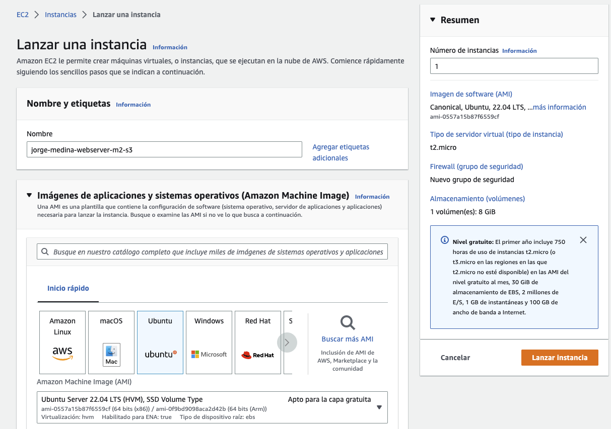

Lugo debemos de usar la imagen de `ubuntu 22.04` de arquitectura `64 bits (x86)` y el tipo de máquina
`t2.micro` la cual entra en el free tier.

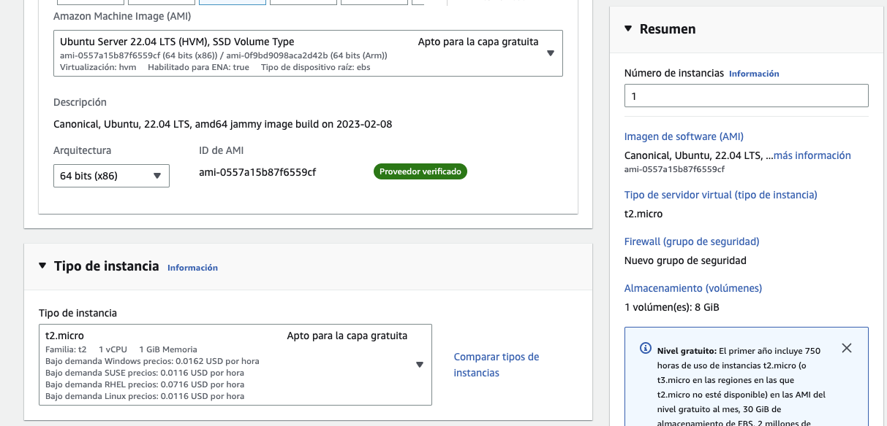

Luego en el par de llaves para inicio de sesión crearemos un nuevo par de llaves, por ejemplo:

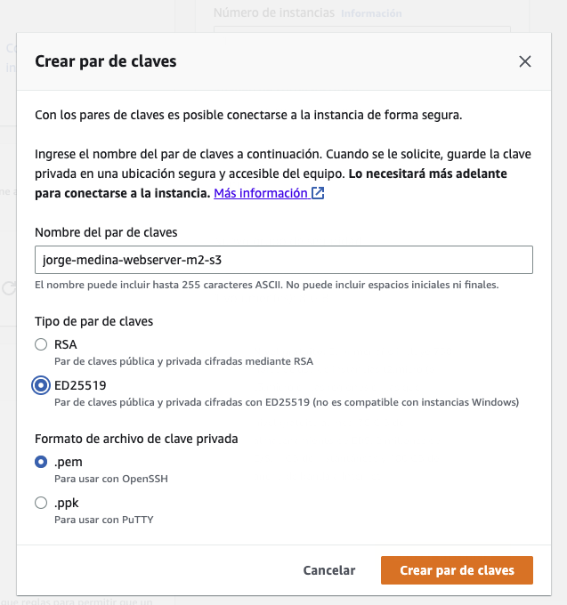

Luego en las configuraciones de red, debemos crear un nuevo grupo de seguridad que permite el
tráfico SSH desde `Mi IP`, por ejemplo:

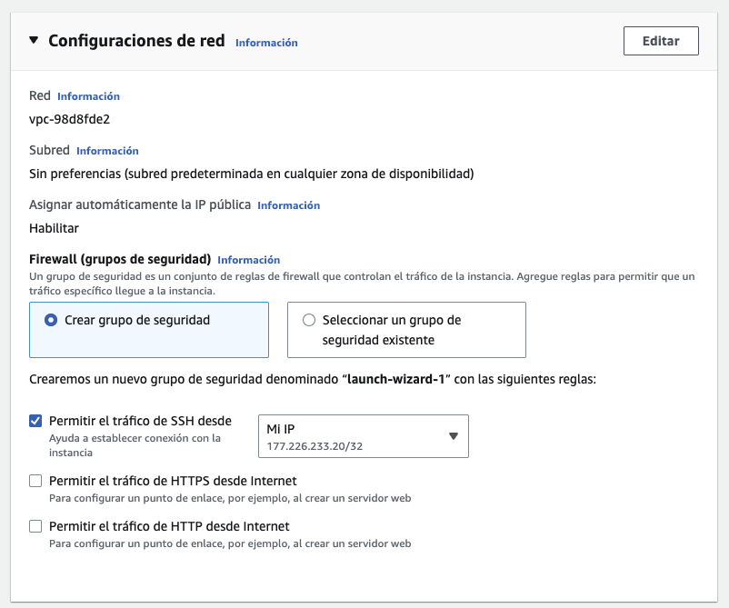

En los parámetros de almacenamiento usaremos los predefinidos, seguido hacemos clic en `lanzar instancia`
para aplicar los cambios.

Esperamos a que se cree la instancia, esto lo sabremos cuando aparezca un mensaje verde de correcto,
y en el estado de la instancia vemos `Comprobación de estado 2/2 comprobaciones superadas`.

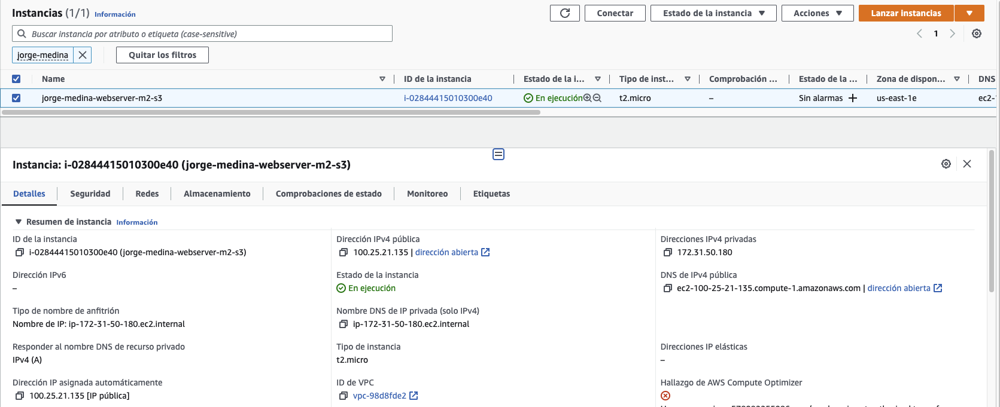

Ahora puedes entrar a cloud9, y subir el archivo de la llave para hacer tu conexión ssh hacia la nueva
instancia.

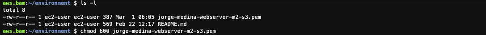

Ahora se puede conectar por ssh al servidor desde la terminal de cloud9:

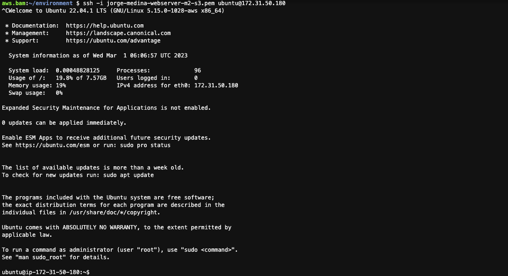

Ahora vamos al módulo `IAM` y vamos al menú `Administración del acceso` y luego en `Políticas` y creamos
una nueva política haciendo clic en `Nueva política.

Hacemos clic en formato JSON y pegamos lo siguiente:

```JSON
{
  "Version": "2012-10-17",
  "Statement": [
    {
      "Effect": "Allow",
      "Action": [
        "logs:CreateLogGroup",
        "logs:CreateLogStream",
        "logs:PutLogEvents"
      ],
      "Resource": "arn:aws:logs:*:*:*"
    },
    {
      "Effect": "Allow",
      "Action": [
        "ec2:Start*",
        "ec2:Stop*"
      ],
      "Resource": "*"
    }
  ]
}
```

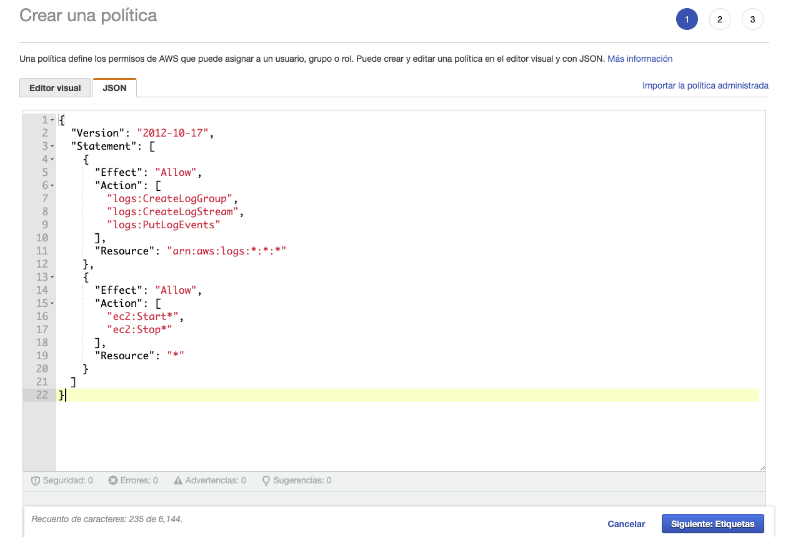

Hacemos clic en `Siguiente` y luego se agregan las `Etiquetas` y al final se revisa la política.

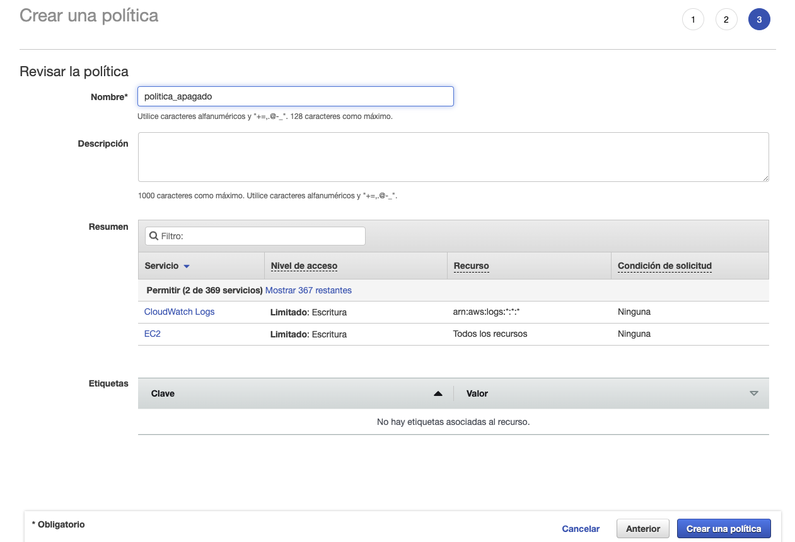

Al final se hace clic en `Crear una política` para terminar.

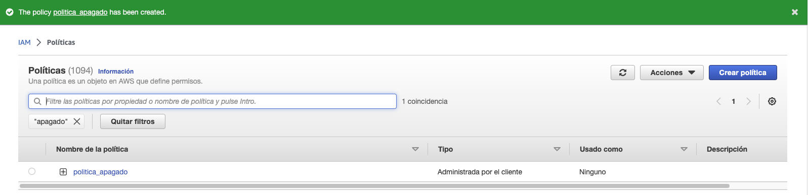

Ahora en `IAM` vamos al menú `Roles` y hacemos clic en `Crear rol`, y usamos las opciones de tipo de entidad
`Servicio de AWS`, caso de uso `Lambda`:

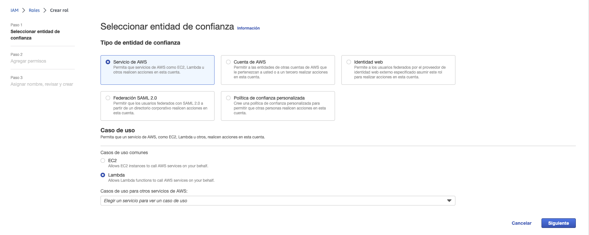

Luego en agregar permisos, debemos buscar la politica de `politica_apagado` que creamos antes, y se selecciona:

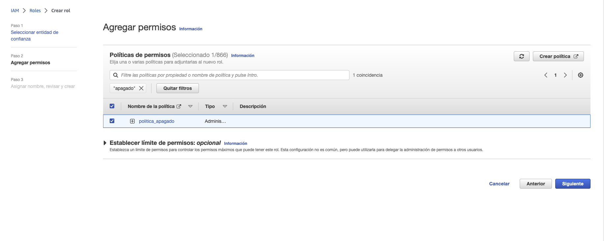

Al final se define el nombre del rol `rol_apagado`, se finaliza y listo, continuamos con la función lambda.

Ahora vamos al módulo `Lambda`, hacemos clic en `Crear función`, y vamos a crear una función desde cero usando
lo siguientes parámetros:

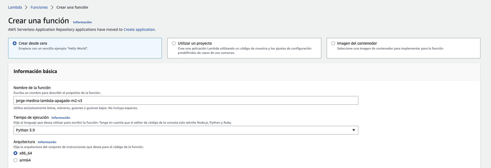

En los permisos cambiamos el rol al que creamos arriba:

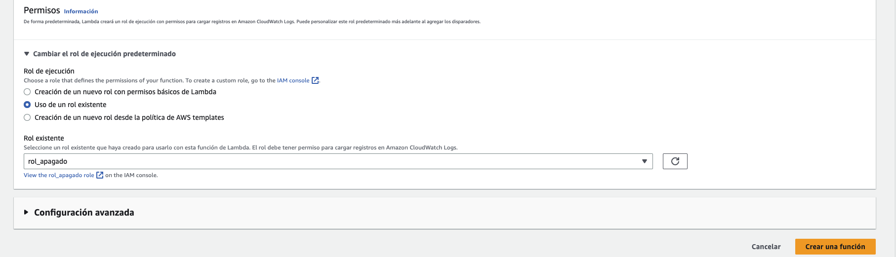

Hacemos clic en `Crear una función` para aplicar los cambios.

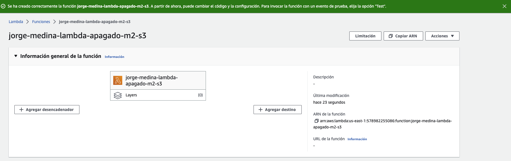

Ahora vamos a la pestaña de `Código` y en el editor eliminamos el código actual y lo cambiamos por el siguiente
código, solo se debe sustituir los datos de la región y el id de la instancia:

```python
import boto3
region = 'us-east-1'
instances = ['<id de la instancia>']
ec2 = boto3.client('ec2', region_name=region)

def lambda_handler(event, context):
    ec2.stop_instances(InstanceIds=instances)
    print('stopped your instances: ' + str(instances))
```

**NOTA**: El ID de la instancia lo puedes obtenerlo desde la consola EC2 bajo la opción `ID de instancia`.

Ahora vamos a la pestaña de configuración y hacemos el cambio del timeout a 15 segundos:

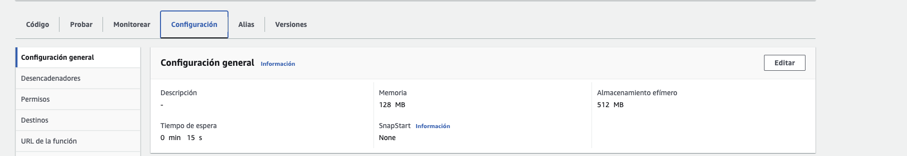

Por último clic en `Deploy` para aplicar los cambios.

Hacemos clic en `TEST`:

Debería dar un resultado como el siguiente:

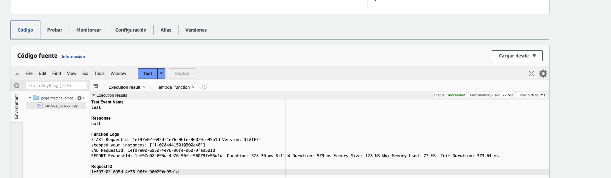

Como resultado verá la instancia ec2 detenida:

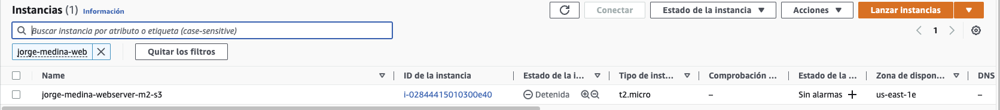

Vuelva a encender la instancia para el próximo ejercicio con event bridge.

Ahora vamos al módulo `EventBridge`, y seleccionamos `Programador de EventBridge`:

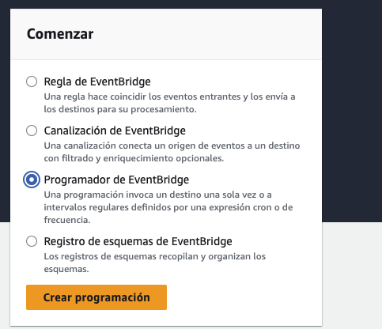

Definimos los siguientes parámetros generales:
* Nombre de la programación: jorge-medina-eventbridge-m2-s3

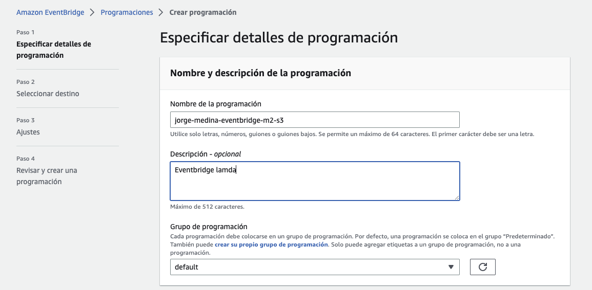

A continuación vamos a especificar los siguientes detalles de programación:

* Ocasión: Programa recurrente
* Tipo de programación: Programación basada en frecuencia
* Expresión de frecuencia: 5 minutos
* Intervalo de tiempo flexible: Desactivado
* Zona horaria: <tu zona horaria>
* Fecha y hora de inicio: <5 minutos después de lo que marque nuestro reloj actualmente>

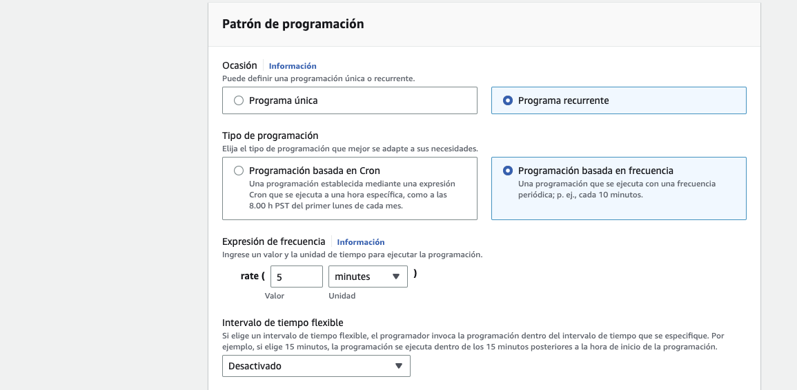

Y luego configuramos en periodo lo siguiente:

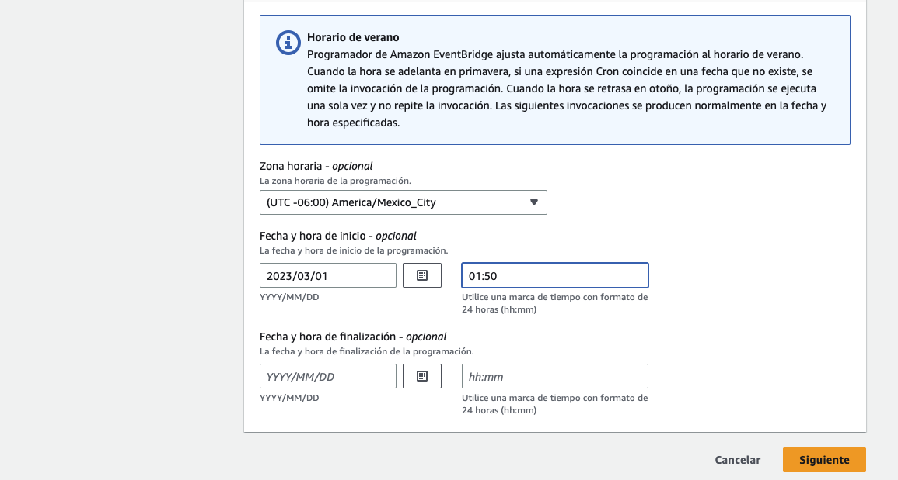

Al final hacemos clic en `Siguiente`.

y en la siguiente ventana de detalles del destino, elegimos `API de uso frecuente` y buscamos
`AWS Lambda Invoke` Y luego configuramos en periodo lo siguiente:


Más abajo en los detalles de `Invoke` seleccionamos la función Lambda que creamos en el ejercicio anterior
de apagado.

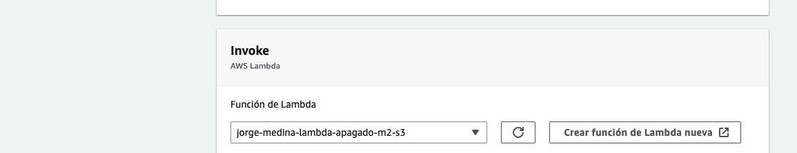

Al final hacemos clic en `Siguiente` y en las siguientes ventanas dejamos los parámetros predeterminados.

Al final revisamos la configuración y hacemos clic en `Crear programación` para terminar.

#### Validación

Una vez que se terminó el proceso de arriba para crearl a programación, debemos esperar los 5 minutos para
comprobar que efectivamente el cron o trabajo recurrente invoca la función lambda y detiene la instancia EC2.

Esto es un ejemplo de arquitectura serverless ejecutada por un evento interno de sistema, con la finalidad
de ahorrar costos en el uso de la infraestructura de AWS.

Prueba un par de veces volver a encender la instancia y mira comprueba que se cumple la regla de los 5 minutos
de apagado, en un caso real, podríamos programar un evento que apague los servidores cada 24 horas a las
23:00 horas y otro que los encienda a las 8:00 horas con esto ahorramos 9 horas de consumo.

### Crear sistemas de archivos distribuídos con AWS EFS

En esta actividad realizaremos un ejercicio donde crearemos un sistema de archivos de red distribuído
usando el servicio EFS de AWS.

#### Ejecución

Antes de crear el recurso EFS, debemos crear unos grupos de seguridad.  En el módulo `EC2` vamos al menú de
`Grupos de Seguridad`, y hacemos clic en el botón de `Crear grupo de seguridad`, y llenamos los datos de
detalles básicos y las reglas de entrada para el primer security group, por ejemplo:

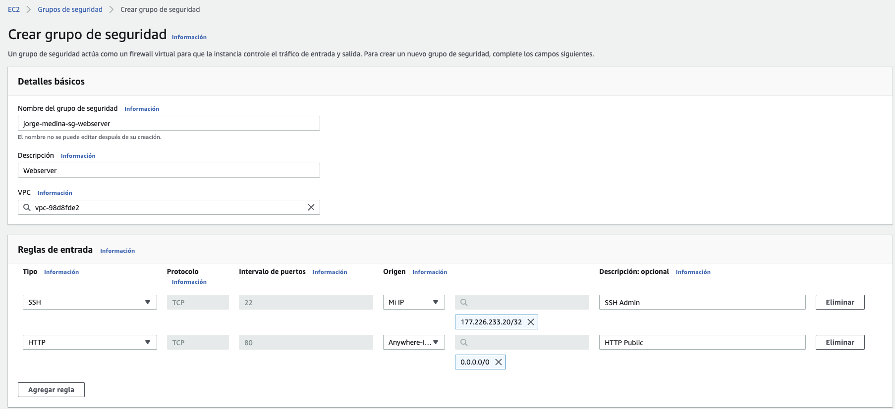

Como se ve arriba, en los detalles básicos se debe especificar el VPC, en este caso usamos el predeterminado.

Además, podemos ver que creamos dos reglas de entrada con lo siguiente:

* Regla 1:
  * Tipo: SSH
  * Origen: Mi IP
* Regla 2:
  * Tipo: HTTP
  * Origen: Anywhere IPv4

Las reglas de salidad se dejan con los valores predeterminados y se configuran las etiquetas
requeridas por la política interna.

Al final de la página hacemos clic en `Crear grupo de seguridad` página para aplicar los cambios.

El nuevo sg quedaría algo así:

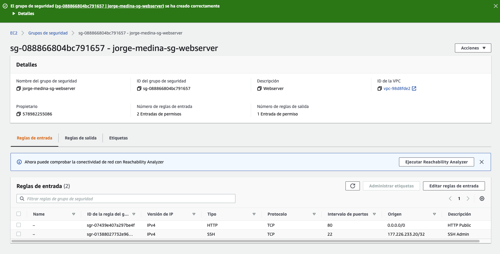

Ahora vamos a crear el segundo security group con los siguientes detalles:

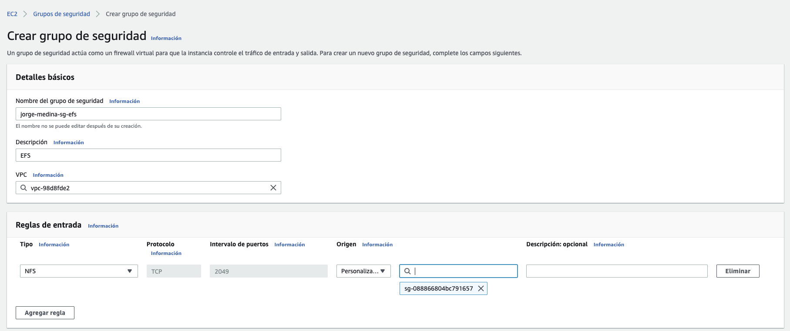

Como se ve arriba, en los detalles básicos se debe especificar el VPC, en este caso
usamos el predeterminado.

Además, podemos ver que creamos dos reglas de entrada con lo siguiente:

* Regla 1:
  * Tipo: NFS
  * Origen: jorge-medina-sg-webserver

Las reglas de salidad se dejan con los valores predeterminados y se configuran las etiquetas
requeridas por la política interna.

Al final hacemos clic en `Crear grupo de seguridad` al final de la página para aplicar los cambios.

El segundo sg quedaría algo así:

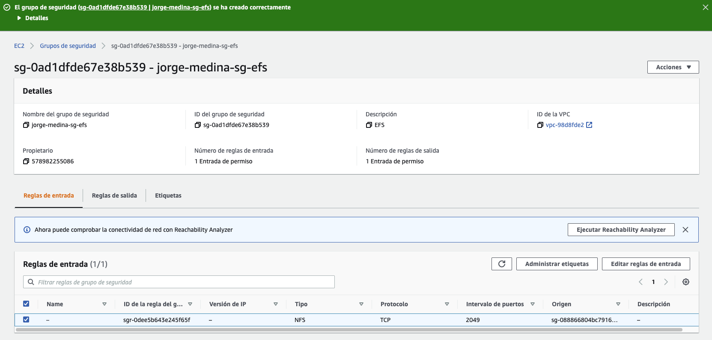

A continuación vamos al módulo `EC2` y luego en el panel lateral izquierdo vamos a Instancias,
a continuación seleccionamos nuestra instancia, damos clic derecho y dentro de `Seguridad`
elegimos `Cambiar grupos de seguridad`.


Dentro del asistente debemos agregar el grupo de seguridad creado llamado webserver y eliminar
el que tenga la instancia asignada. Con esto garantizamos que se publiquen los puertos elegidos.

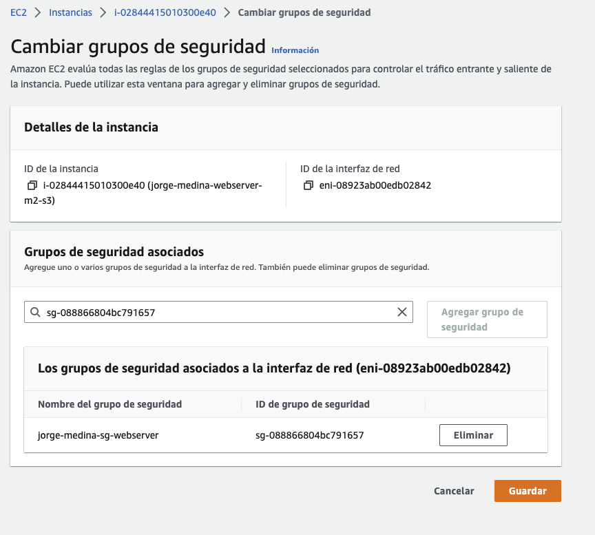

Y por último vamos a elegir Guardar.

Ahora vamos al módulo EFS, creamos un sistema de archivos EFS, ponemos el nombre, elegimos el
VPC y la clase Estandar, luego hacemos clic en Personalizar:

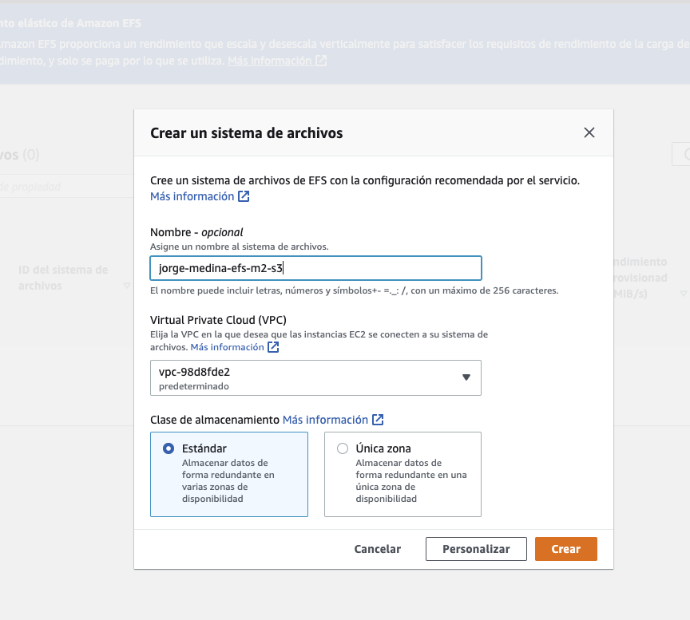

Personalizamos la instancia estandar, sin copias de seguridad, sin transmisión de acceso para
rafagas, y sin crifrado.

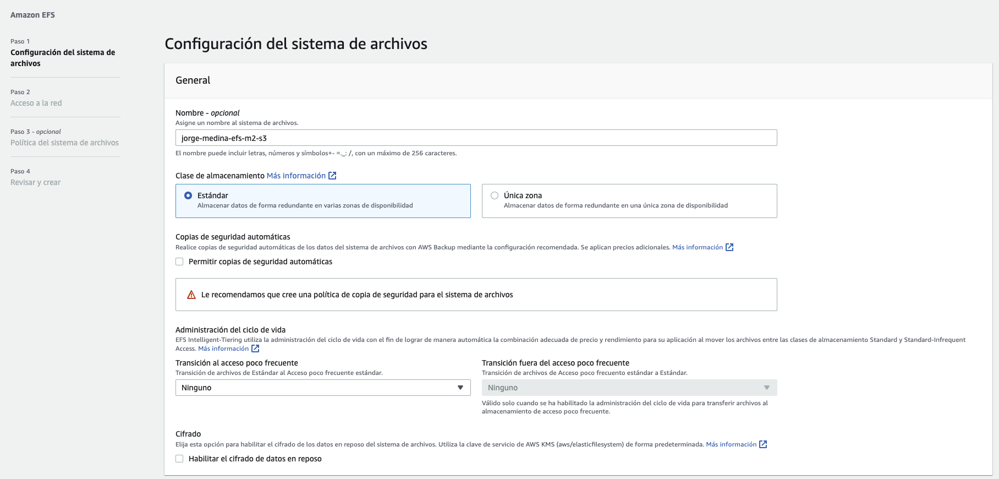

Creamos una instancia estandar, sin copias de seguridad, sin transmisión de acceso para rafagas,
y sin crifrado.


Ahora se selecciona el VPC, la zona de disponibilidad y la subred, y luego el grupo de seguridad se
elimina el predefinido, y se agrega el que creamos antes de efs.

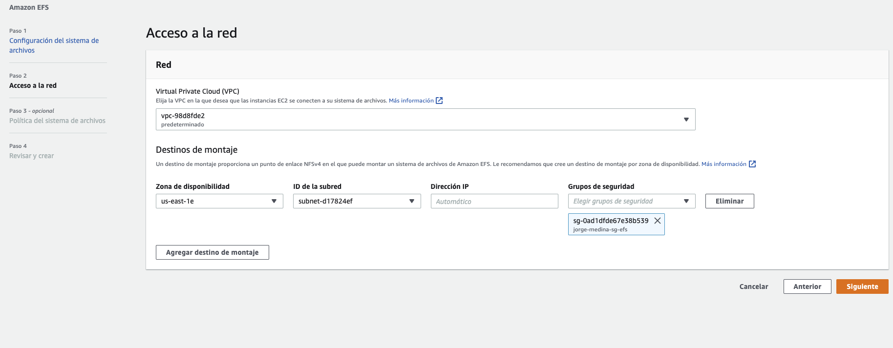

En las políticas del sistema de archivos dejamos los parámetros predefinidos y hacemos clic en `Siguiente`. Al final se revisa y se crea el EFS.

Al final el servicio queda así:

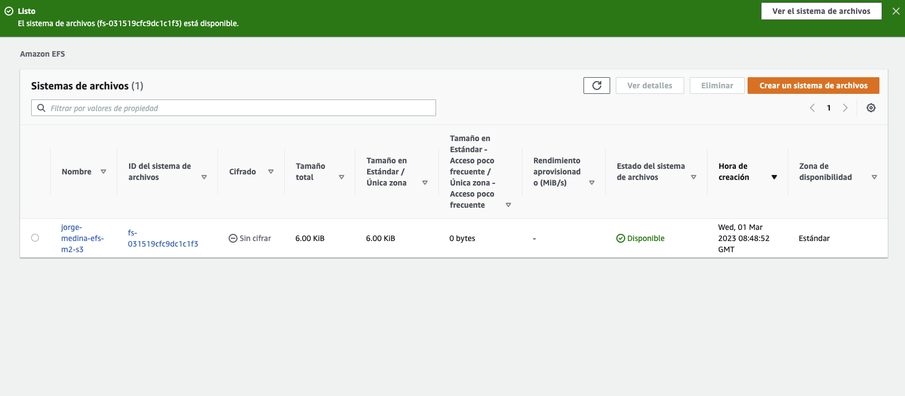

Luego debemos entrar a los detalles del EFS, y vamos a la pestaña Redes, y ahi vemos los ID del destino del montaje disponibles:

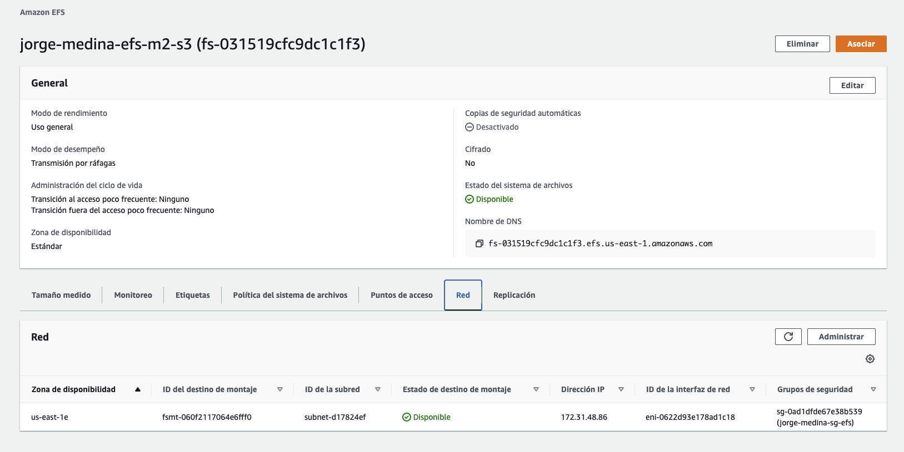

#### Validación

Nos conectamos a la instancia `Cloud9` y subiremos el archivo de la llave SSH de la instancia EC2 `webserver`.

Desde la tarminal de `Cloud9`, cambiamos los permisos a la llave:

```shell
$ chmod 600 jorge-medina-webserver-m2-s3.pem
```

Ahora, hacemos la conexión al servidor EC2 `webserver`:

```shell
$ ssh -i jorge-medina-webserver-key.pem ubuntu@172.31.58.255
```

Regresamos al servicio EC2, y seleccionamos nuestra instancia webserver.

Luego nos conectamos por ssh a la instancia y ejecutamos los siguientes comandos:

```shell
$ sudo apt upgrade
$ sudo ufw allow 'Apache'
$ sudo systemctl status apache2
```

Instalación de efs-utils:

```shell
$ sudo apt-get -y install git binutils
$ sudo git clone https://github.com/aws/efs-utils
$ cd efs-utils
$ sudo ./build-deb.sh
$ sudo apt-get -y install ./build/amazon-efs-utils*deb
```

Creamos punto de montaje:

```shell
$ cd /var/www/html
$ mkdir efs
$ sudo mount -t efs fs-0507652098b5b1f01.efs.us-east-1.amazonaws.com efs/
$ ls
```

Ahora creamos index en recurso EFS:

```shell
$ cd efs
$ touch index.html
$ vim index.html
```

Agregar el contenido siguiente:

```html
<h1>ESTE SITIO SE ESTA SIRVIENDO DESDE EFS</h1>
```

Guardamos.

Al final:

```shell
$ cd ..
$ sudo umount efs
```

### Crear bases de datos relacionales con AWS RDS Aurora

En esta actividad realizaremos un ejercicio donde crearemos una base de datos usando el servicio de
bases de datos SQL serverless RDS Aurora, el cual el un servicio administrado por AWS, es seguro y
escalable. Crearemos la base de datos para una instancia de `Wordpress`, luego haremos la instalación
de wordpress integrado con una base de datos MySQL por red usando la instancia Aurora MySQL.

#### Ejecución

Vamos a hacer una instalación de la aplicación web `Wordpress` en la instancia EC2 `webserver`. Desde la
terminal de la instancia `Cloud9` nos conectamos por ssh la instancia EC2 `webserver`:

```shell
$ ssh -i jorge-medina-webserver-key.pem ubuntu@172.31.58.255
```

**NOTA:** Estoy usando la dirección IP privada de la instancia EC2.

Estando en el shell del servidor `webserver` debemos instalar en primer lugar las dependencias de software:

```shell
$ sudo apt update
$ sudo apt install php php-mysql mysql-client
```

Clonamos el repositorio de wordpress desde github:

```shell
% cd /var/www/html
$ sudo git clone https://github.com/WordPress/WordPress.git
```

Ahora cambiamos los permisos al directorio de trabajo para wordpress y reiniciamos el servidor web apache:

```shell
$ sudo chmod -R 777 WordPress
$ sudo service apache2 restart
```

**IMPORTANTE:** No usar estos permisos en un ambiente de producción ya que no son los más seguros y genera
una vulnerabilidad, solo lo hacemos por fines de laboratorio.

Ahora, vamos al módulo `RDS` y hacemos clic en `Crear base de datos`, usamos las siguientes configuraciones:

* Elegir un método de creación de base de datos: Creación estándar
* Opciones del motor: Aurora (MySQL Compatible)
* Versiones disponibles: Aurora (MySQL 5.7 ) 2.11.1
* Plantillas: Desarrollo y pruebas
* Identificador del clúster de base de datos: wordpress
* Nombre de usuario maestro: admin
* Contraseña maestra: W0rdpr3ss01.
* Clases con ráfagas (incluye clases t): db.t3.small
* Implementación Multi-AZ: No crear una réplica de Aurora
* Conectividad: No se conecte a un recurso EC2 (porque ya creamos nuestro Security Group)
* Conectividad: Tipo de Red: IPv4
* Conectividad: Virtual Private Cloud (VPC): Crear nueva VPC.
* Conectividad: Grupo de subred de DB: Crear un nuevo grupo de subredes de base de datos.
* Acceso público: Si
* Grupo de seguridad de VPC (firewall): Elegir Existente: Aurora-SG (El creado recientemente)

Después de crear la instancia debemos de editar el security group asociado y permitir la conexión
al servidor EC2, usando su dirección IP externa en una nueva regla de entrada.

En el módulo `EC2`, luego a `Grupos de Seguridad` y luego hacemos clic en el security group asociado
a la instancia RDS, y agregamos una regla de entrada con lo siguiente:

* Nombre: Aurora-SG
* Descripción: Aurora-SG
* VPC: Default
* Regla de entrada: MySQL/Aurora, TCP, 3306, Personalizado: ip-externa-ec2-webserver, desc; Aurora MySQL for Webserver

Después de crear la instancia listamos las bases de datos abrimos el URL de la IP o nommbre DNS
de la instancia EC2, y agregamos `/wordpress` en el path para lanzar el instalador.

Verificar la ventana de confirmación de Wordpress.

Pasos a seguir:

Si todo sale bien, esperamos una ventana como en la imagen y damos Clic en Run the Installation.

#### Validación

Una vez que se creó la instancia RDS, debemos seleccionar la nueva instancia y en la pestaña de
`Conectividad y seguridad`, ahi veremos el `Punto de enlace y puerto`, en este caso el valor es
`jorge-medina-rds-wordpress-instance-1.cxilimkckchq.us-east-1.rds.amazonaws.com` con puerto `3306`.

Desde el shell de la instancia EC2 webserver, hacemos una conexión con el cliente MySQL, por ejemplo:

```shell
$ mysql --host jorge-medina-rds-wordpress-instance-1.cxilimkckchq.us-east-1.rds.amazonaws.com --user admin --password
```

Ahora creamos la nueva base:

```shell
mysql> CREATE DATABASE wordpress;
mysql> USE wordpress;
mysql> SHOW DATABASES;
mysql> \q
```

Después de haber creado el esquema de la base de datos wordpress en la instancia RDS Aurora continuamos
con la instalación y configuración de la aplicación wordpress en la instancia EC2.

Vamos al URL http://ip-publica-ec2-webserver/WordPress/, 

En el asistente nos solitica los parámetros de conexión a la base de datos:

* Database Name: wordpress
* Username: admin
* Password: pass
* Database Host: jorge-medina-rds-wordpress-instance-1.cxilimkckchq.us-east-1.rds.amazonaws.com
* Table Prefix: wp_

* Site Title: Sitio con Aurora
* Username: admin
* Password
* Confirm Password
* Your Email:
* Search engine visibility: checked

Ahora hacemos clic en `Install Wordpress`.

Al final del proceso dee instalación debemos configurar la contraseña para el usuario admin.

Y por último, ya podemos iniciar sesión.

## Limpieza

Es sumamente importante señalar que después de que hemos realizado la actividad de la sesión
y hemos terminado de usar los recursos cloud que creamos es nuestra responsabilidad hacer
una limpieza de los recursos utilizados para no incurrir en más gastos en la cuenta AWS, por
lo que recomendados hacer una limpieza de los recursos.

## Referencias

La siguiente es una lista de referencias que pueden usar para complementar
lo que se expone en esta sesión.

* [Sin servidor en AWS](https://aws.amazon.com/es/serverless/?nc1=h_ls)
* [AWS Lambda](https://aws.amazon.com/es/lambda/)
* [Carácteristicas de AWS Lambda](https://aws.amazon.com/es/lambda/features/?pg=ln&sec=hs)
* [How do I stop and start Amazon EC2 instances at regular intervals using Lamda?](https://aws.amazon.com/premiumsupport/knowledge-center/start-stop-lambda-eventbridge/)
* [Crear un sistema de archivos de red](https://aws.amazon.com/es/getting-started/tutorials/create-network-file-system/?pg=ln&sec=hs)
* [Amazon RDS](https://aws.amazon.com/es/rds/)