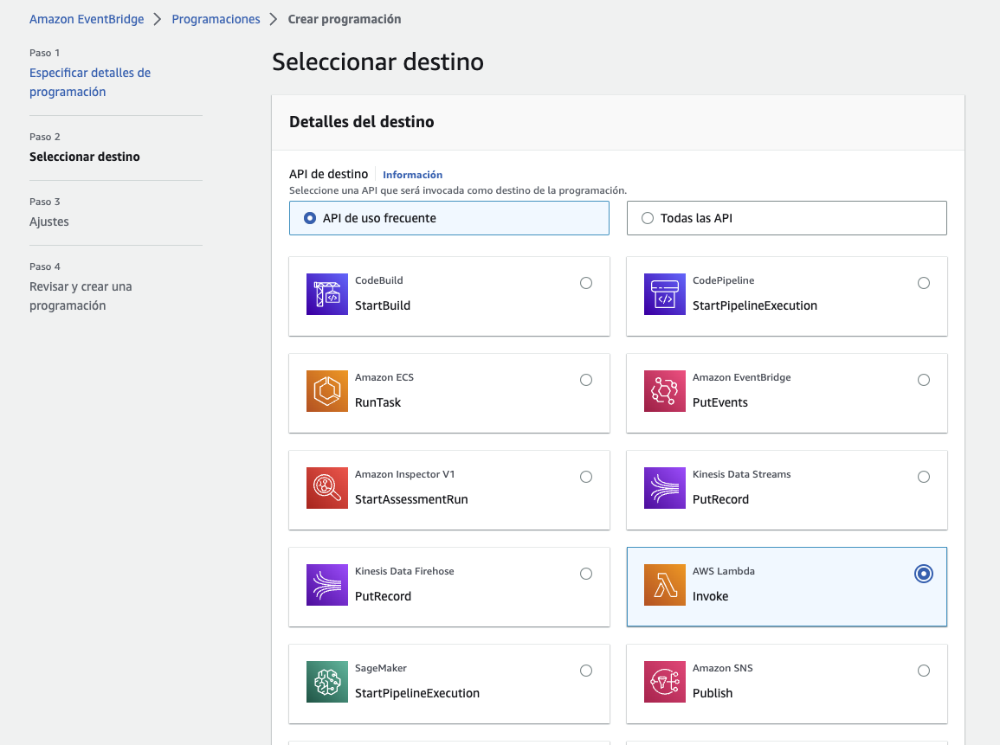

# Sesión 03: Serverless mindset

## Introducción

En esta tercera sesión de work pondremos en práctica los diferentes conceptos de
serverless y los servicios que eventos y almacenamiento de datos en AWS.

### Objetivos

Los objetivos especificos para el work de esta sesión son:

* Identificar las ventajas de los servicios serverless
* Comprender el enfoque de delegación del recurso al user servicios serverless
* Examinar los principales servicios serverless de AWS, por medio de ejemplos y casos de uso

## Requisitos

Para poder realizar las siguientes actividades es necesario lo siguiente:

* Una computador con acceso a Internet
* Una cuenta de usuario de AWS
* Permisos de acceso para usar los servicios:
  * AWS Cloud9
  * AWS EC2
  * AWS Lambda
  * AWS EventBridge
  * AWS EFS
  * AWS RDS

Una vez que se ha creado el entorno cloud9, hacemos clic en `Open in Cloud9` para abrir el URl con
el entorno de desarrollo web.

En `Cloud9`, vamos a la `Terminal` y ahi hacemos las siguientes validaciones para ver que ya tengamos
docker configurado y listo para usarse.

## Actividades

En esta sesión realizaremos las siguientes actividades:

* Crear un programador de EventBridge para invocar función Lambda
* Crear sistemas de archivos distribuídos con AWS EFS
* Crear bases de datos relacionales con AWS RDS Aurora

### Crear un programador de EventBridge para invocar función Lambda

En esta actividad realizaremos un ejercicio donde crearemos una función que se usará para apagar
instancias EC2, y dicha función se invocará por medio de un programador de eventos en AWS EventBridge.

#### Ejecución

En el ejercicio para esta actividad debemos crear una instancia `EC2` con la cual probaremos las diferentes
integraciones de una lambda con un programador de eventos y también integraremos una base de datos
usando los servicios de EFS y RDS en las siguientes actividades de esta sesión.

Vamos al módulo `EC2`, hacemos clic en `Lanzar instancia` y llenamos los parámetros:


Lugo debemos de usar la imagen de `ubuntu 22.04` de arquitectura `64 bits (x86)` y el tipo de máquina
`t2.micro` la cual entra en el free tier.


Luego en el par de llaves para inicio de sesión crearemos un nuevo par de llaves, por ejemplo:


Luego en las configuraciones de red, debemos crear un nuevo grupo de seguridad que permite el
tráfico SSH desde `Mi IP`, por ejemplo:


En los parámetros de almacenamiento usaremos los predefinidos, seguido hacemos clic en `lanzar instancia`
para aplicar los cambios.

Esperamos a que se cree la instancia, esto lo sabremos cuando aparezca un mensaje verde de correcto,
y en el estado de la instancia vemos `Comprobación de estado 2/2 comprobaciones superadas`.


Ahora puedes entrar a cloud9, y subir el archivo de la llave para hacer tu conexión ssh hacia la nueva
instancia.


Ahora se puede conectar por ssh al servidor desde la terminal de cloud9:


Ahora vamos al módulo `IAM` y vamos al menú `Administración del acceso` y luego en `Políticas` y creamos
una nueva política haciendo clic en `Nueva política.

Hacemos clic en formato JSON y pegamos lo siguiente:

```JSON
{
  "Version": "2012-10-17",
  "Statement": [
    {
      "Effect": "Allow",
      "Action": [
        "logs:CreateLogGroup",
        "logs:CreateLogStream",
        "logs:PutLogEvents"
      ],
      "Resource": "arn:aws:logs:*:*:*"
    },
    {
      "Effect": "Allow",
      "Action": [
        "ec2:Start*",
        "ec2:Stop*"
      ],
      "Resource": "*"
    }
  ]
}
```


Hacemos clic en `Siguiente` y luego se agregan las `Etiquetas` y al final se revisa la política.


Al final se hace clic en `Crear una política` para terminar.


Ahora en `IAM` vamos al menú `Roles` y hacemos clic en `Crear rol`, y usamos las opciones de tipo de entidad `Servicio de AWS`, caso de uso `Lambda`:


Luego en agregar permisos, debemos buscar la politica de `politica_apagado` que creamos antes, y se selecciona:


Al final se define el nombre del rol `rol_apagado`, se finaliza y listo, continuamos con la función lambda.

Ahora vamos al módulo `Lambda`, hacemos clic en `Crear función`, y vamos a crear una función desde cero usando lo siguientes parámetros:


En los permisos cambiamos el rol al que creamos arriba:


Hacemos clic en `Crear una función` para aplicar los cambios.


Ahora vamos a la pestaña de `Código` y en el editor eliminamos el código actual y lo cambiamos por el siguiente código, solo se debe sustituir los datos de la región y el id de la instancia:

```python
import boto3
region = 'us-east-1'
instances = ['<id de la instancia>']
ec2 = boto3.client('ec2', region_name=region)

def lambda_handler(event, context):
    ec2.stop_instances(InstanceIds=instances)
    print('stopped your instances: ' + str(instances))
```

**NOTA**: El ID de la instancia lo puedes obtenerlo desde la consola EC2 bajo la opción `ID de instancia`.

Ahora vamos a la pestaña de configuración y hacemos el cambio del timeout a 15 segundos:


Por último clic en `Deploy` para aplicar los cambios.

Hacemos clic en `TEST`:

Debería dar un resultado como el siguiente:


Como resultado verá la instancia ec2 detenida:


Vuelva a encender la instancia para el próximo ejercicio con event bridge.

Ahora vamos al módulo `EventBridge`, y seleccionamos `Programador de EventBridge`:


Definimos los siguientes parámetros generales:
* Nombre de la programación: jorge-medina-eventbridge-m2-s3


A continuación vamos a especificar los siguientes detalles de programación:

* Ocasión: Programa recurrente
* Tipo de programación: Programación basada en frecuencia
* Expresión de frecuencia: 5 minutos
* Intervalo de tiempo flexible: Desactivado
* Zona horaria: <tu zona horaria>
* Fecha y hora de inicio: <5 minutos después de lo que marque nuestro reloj actualmente>


Y luego configuramos en periodo lo siguiente:


Al final hacemos clic en `Siguiente`.

y en la siguiente ventana de detalles del destino, elegimos `API de uso frecuente` y buscamos
`AWS Lambda Invoke` Y luego configuramos en periodo lo siguiente:



Más abajo en los detalles de `Invoke` seleccionamos la función Lambda que creamos en el ejercicio anterior de apagado.


Al final hacemos clic en `Siguiente` y en las siguientes ventanas dejamos los parámetros predeterminados.

Al final revisamos la configuración y hacemos clic en `Crear programación` para terminar.

#### Validación

### Crear sistemas de archivos distribuídos con AWS EFS

En esta actividad realizaremos un ejercicio donde crearemos un sistema de archivos distribuído
usando el servicio EFS de AWS.

#### Ejecución

Para crear un sistema de archivos distribuído, vamos al módulo `EFS`, 


Antes de crear el recurso EFS, debemos crear unos grupos de seguridad.

En el módulo `EC2` vamos al menú de `Grupos de Seguridad`, y hacemos clic en el botón de
`Crear grupo de seguridad`, y llenamos los datos de detalles básicos y las reglas de
entrada para el primer security group, por ejemplo:


Como se ve arriba, en los detalles básicos se debe especificar el VPC, en este caso
usamos el predeterminado.

Además, podemos ver que creamos dos reglas de entrada con lo siguiente:

* Regla 1:
  * Tipo: SSH
  * Origen: Mi IP
* Regla 2:
  * Tipo: HTTP
  * Origen: Anywhere IPv4

Las reglas de salidad se dejan con los valores predeterminados y se configuran las etiquetas
requeridas por la política interna.

Al final de la página hacemos clic en `Crear grupo de seguridad` página para aplicar los cambios.

El nuevo sg quedaría algo así:


Ahora vamos a crear el segundo security group con los siguientes detalles:


Como se ve arriba, en los detalles básicos se debe especificar el VPC, en este caso
usamos el predeterminado.

Además, podemos ver que creamos dos reglas de entrada con lo siguiente:

* Regla 1:
  * Tipo: NFS
  * Origen: jorge-medina-sg-webserver

Las reglas de salidad se dejan con los valores predeterminados y se configuran las etiquetas
requeridas por la política interna.

Al final hacemos clic en `Crear grupo de seguridad` al final de la página para aplicar los cambios.

El segundo sg quedaría algo así:


#### Validación

TODO


### Crear bases de datos relacionales con AWS RDS Aurora

En esta actividad realizaremos un ejercicio donde...


#### Ejecución

TODO.


#### Validación

TODO.

## Limpieza

Es sumamente importante señalar que después de que hemos realizado la actividad de la sesión
y hemos terminado de usar los recursos cloud que creamos es nuestra responsabilidad hacer
una limpieza de los recursos utilizados para no incurrir en más gastos en la cuenta AWS, por
lo que recomendados hacer una limpieza de los recursos.

## Referencias

La siguiente es una lista de referencias que pueden usar para complementar
lo que se expone en esta sesión.

* [Sin servidor en AWS](https://aws.amazon.com/es/serverless/?nc1=h_ls)
* [AWS Lambda](https://aws.amazon.com/es/lambda/)
* [Carácteristicas de AWS Lambda](https://aws.amazon.com/es/lambda/features/?pg=ln&sec=hs)
* [How do I stop and start Amazon EC2 instances at regular intervals using Lamda?](https://aws.amazon.com/premiumsupport/knowledge-center/start-stop-lambda-eventbridge/)