# Sesión 04: Gestión de contenedores con Kubernetes y EKS

## Introducción

En esta cuarta sesión de work pondremos en práctica los diferentes conceptos de
la orquestación de contenedores con Kubernetes, su arquitectura, componentes y 
la implementación con el servicio EKS de AWS.

### Objetivos

Los objetivos especificos para el work de esta sesión son:

* Reconocer Kubernetes, componentes y arquitectura, así como el servicio EKS
* Ejecutar Cluster con un sitio web de prueba

## Requisitos

Para poder realizar las siguientes actividades es necesario lo siguiente:

* Una computador con acceso a Internet
* Una cuenta de usuario de AWS
* Permisos de acceso para usar los servicios:
  * AWS IAM
  * AWS Cloud9
  * AWS EC2
  * AWS EKS

## Actividades

En esta sesión realizaremos las siguientes actividades:

* Crear un Cluster Kubernetes con EKS y desplegar un sitio web de prueba

### Crear un Cluster Kubernetes con EKS y desplegar un sitio web de prueba

En esta actividad realizaremos un ejercicio donde crearemos un cluster Kubernetes usando el servicio
de AWS EKS, el cual es un servicio administrado de Kubernetes, permite trabajar con grupos de nodos
EC2 para ejecutar las cargas de trabajo y también en modo serverless con Fargate. El cluster
desplegaremos una aplicación de ejemplo y publicaremos el servicio para ser consumido por el público.

#### Ejecución

Para esta sesión usaremos una máquina EC2 como bastión o pivote desde la cual usaremos las diferentes
herramientas para interactuar con Kubernetes.

Se recomienda que se tenga una instancia Cloud9 desde la cual se puedan subir archivos, editarlos, y
desde ahí conectarse por SSH a la instancia EC2 arriba mencionado.

Vamos al módulo `EC2`, hacemos clic en `Lanzar instancia` y llenamos los parámetros:

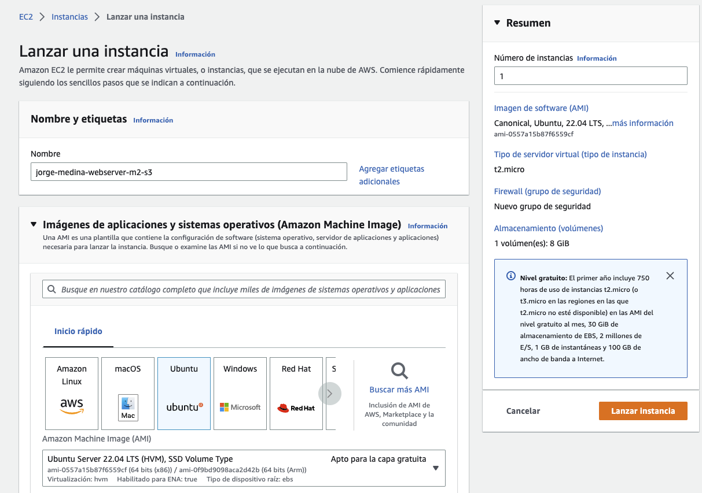

Lugo debemos de usar la imagen de `ubuntu 22.04` de arquitectura `64 bits (x86)` y el tipo de máquina
`t2.micro` la cual entra en el free tier.

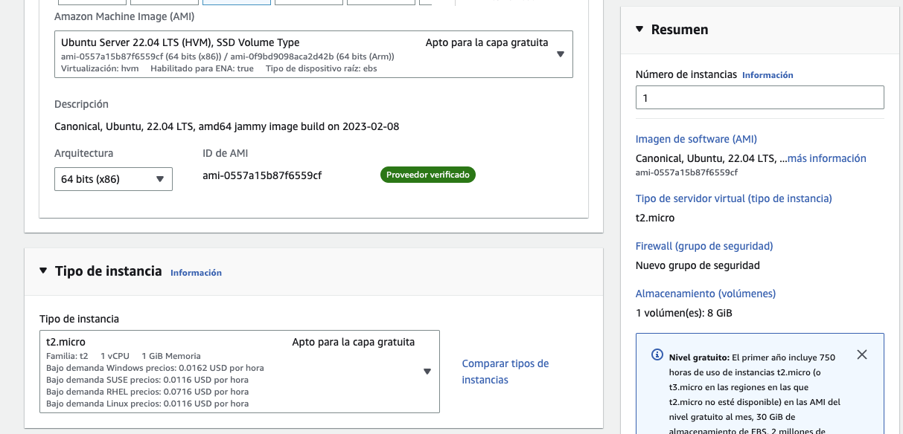

Luego en el par de llaves para inicio de sesión crearemos un nuevo par de llaves, por ejemplo:

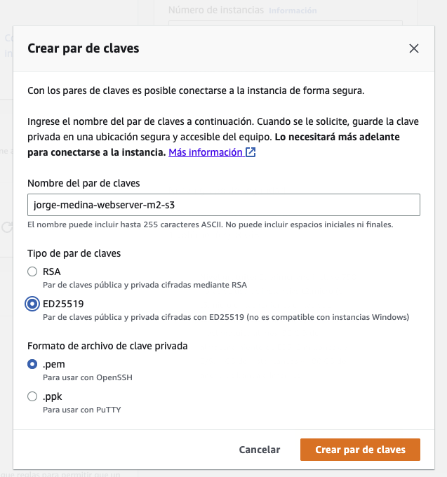

Luego en las configuraciones de red, debemos crear un nuevo grupo de seguridad que permite el
tráfico SSH desde `Mi IP`, por ejemplo:

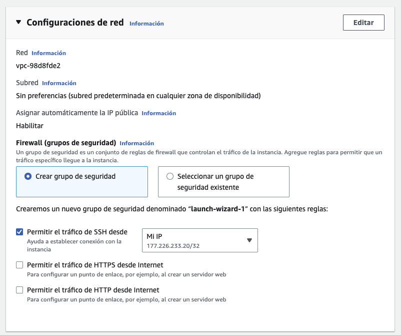

En los parámetros de almacenamiento usaremos los predefinidos, seguido hacemos clic en `lanzar instancia`
para aplicar los cambios.

Esperamos a que se cree la instancia, esto lo sabremos cuando aparezca un mensaje verde de correcto,
y en el estado de la instancia vemos `Comprobación de estado 2/2 comprobaciones superadas`.

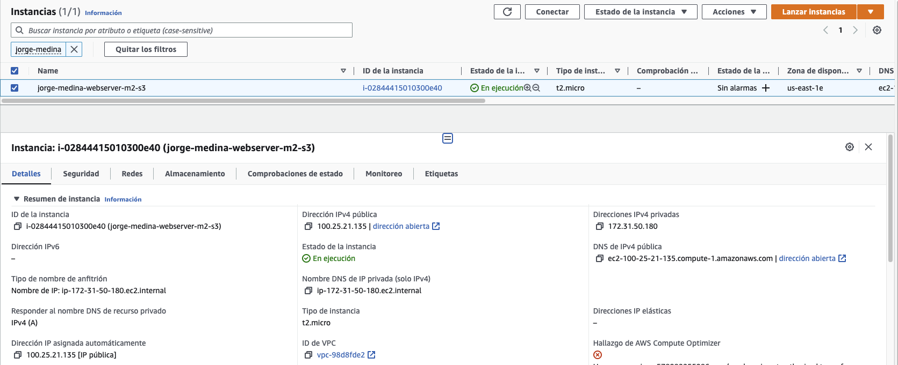

Lo siguiente, es crear un rol en `IAM` para usarlo desde la instancia EC2 para crear el cluster desde la terminal.

Vamos al servicio `IAM`, luego a `Roles`, y hacemos clic en `Crear rol`.

En `Tipo de entidad de confianza` usamos `Servicio de AWS` y en `Casos de uso comunes`, usamos `EC2`:

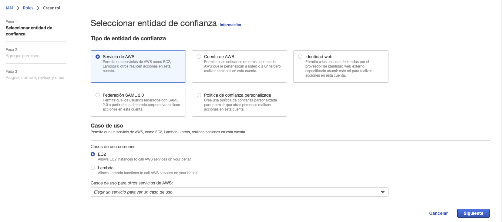

Luego en la parte de `Añadir Permisos` debemos agregar las siguientes políticas:
* AmazonEC2FullAccess
*	IAMFullAccess
*	AdministratorAccess
*	AWSCloudFormationFullAccess
*	AmazonEC2ContainerRegistryFullAccess

Luego hacemos clic en `Siguiente`, se pone nombre al rol y descripción, y se confirma haciendo clic
en `Crear rol`.

Al final quedará así:

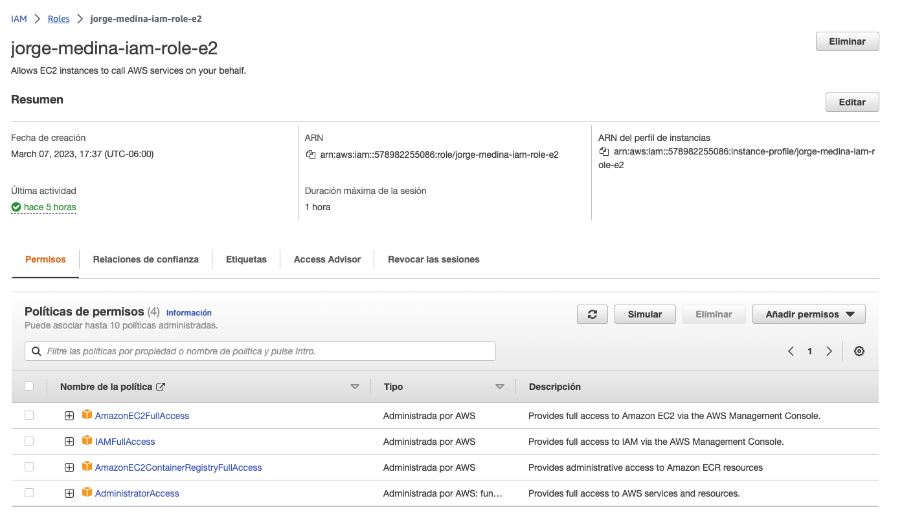

Después de crear el rol, vamos a el módulo `EC2` y seleccionamos la instancia que creamos arriba,
hacemos clic derecho y vamos a `Seguridad`, luego en `Modificar rol de IAM`

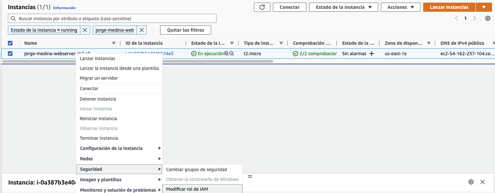

Y en el selector de roles seleccionamos el rol arriba creado y hacemos clic en `Actualizar rol de IAM`:

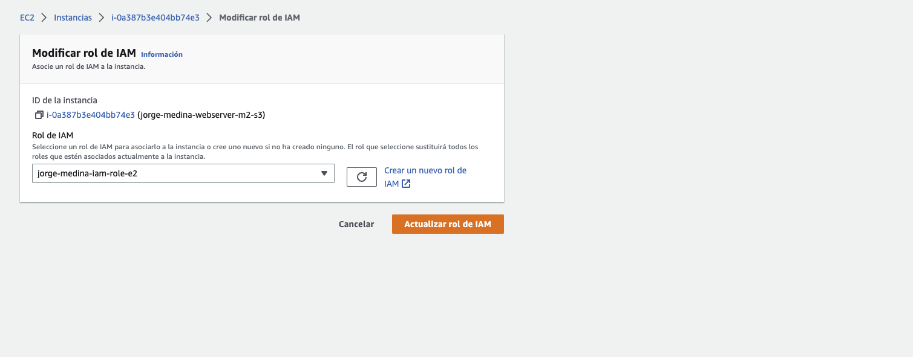

Al final en los detalles de la instancia, en seguridad, veremos el cambio del rol reflejado:

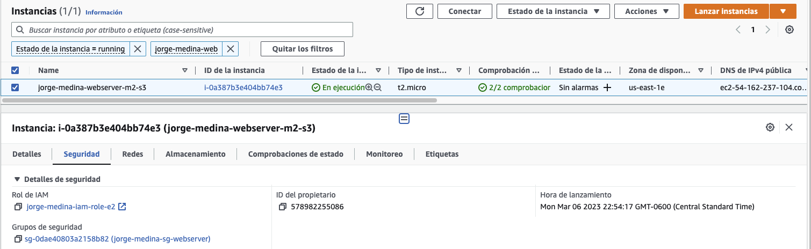

Ahora puedes entrar a cloud9, y subir el archivo de la llave para hacer tu conexión ssh hacia la nueva
instancia.

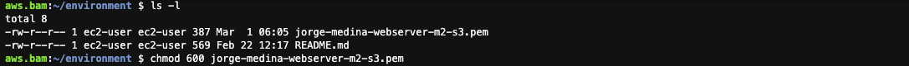

Ahora se puede conectar por ssh al servidor desde la terminal de cloud9:

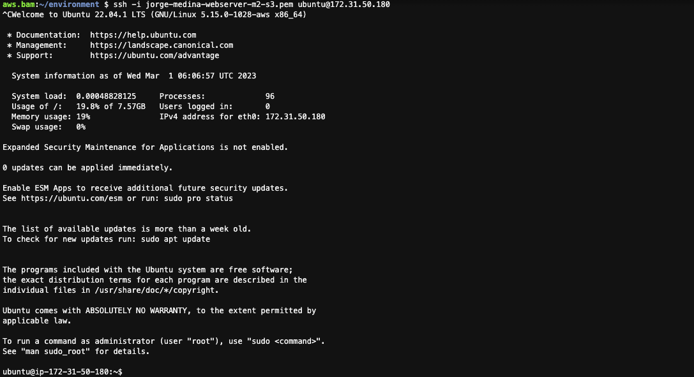

Para crear el cluster kubernetes en el servicio EKS, primero debemos de instalar algunas herramientas en una instancia EC2.

Primero instalamos el CLI de AWS:

```shell
$ curl "https://awscli.amazonaws.com/awscli-exe-linux-x86_64.zip" -o "awscliv2.zip"
$ sudo apt install unzip
$ unzip awscliv2.zip
$ sudo ./aws/install
```

Ahora necesitamos instalar kubectl para ello vamos a descargarlo desde el repositorio oficial:

```shell
$ curl -O https://s3.us-west-2.amazonaws.com/amazon-eks/1.24.7/2022-10-31/bin/linux/amd64/kubectl
```

Y cambiamos los permisos de la carpeta:

```shell
$ chmod +x ./kubectl
```

A continuación movemos la carpeta:

```shell
$ sudo mv kubectl /usr/local/bin
```

Y verificamos la instalación con un 

```shell
$ kubectl version
```

Ahora toca el turno de instalar eksctl:

Descargamos:

```shell
$ curl --silent --location "https://github.com/weaveworks/eksctl/releases/latest/download/eksctl_$(uname -s)_amd64.tar.gz" | tar xz -C /tmp
```

Movemos: 

```shell
$ sudo mv /tmp/eksctl /usr/local/bin
```

Verificamos:

```shell
$ eksctl version
```

Ahora ejecutamos eksctl con los siguientes parámetros:

```shell
$ eksctl create cluster --name jorge-medina-eks-demo --region us-east-1 --zones us-east-1a,us-east-1b,us-east-1c --node-type t2.small
2023-03-08 08:09:39 [ℹ]  eksctl version 0.132.0
2023-03-08 08:09:39 [ℹ]  using region us-east-1
2023-03-08 08:09:39 [ℹ]  subnets for us-east-1a - public:192.168.0.0/19 private:192.168.96.0/19
2023-03-08 08:09:39 [ℹ]  subnets for us-east-1b - public:192.168.32.0/19 private:192.168.128.0/19
2023-03-08 08:09:39 [ℹ]  subnets for us-east-1c - public:192.168.64.0/19 private:192.168.160.0/19
2023-03-08 08:09:39 [ℹ]  nodegroup "ng-72a94b36" will use "" [AmazonLinux2/1.24]
2023-03-08 08:09:39 [ℹ]  using Kubernetes version 1.24
2023-03-08 08:09:39 [ℹ]  creating EKS cluster "jorge-medina-eks-demo" in "us-east-1" region with managed nodes
2023-03-08 08:09:39 [ℹ]  will create 2 separate CloudFormation stacks for cluster itself and the initial managed nodegroup
2023-03-08 08:09:39 [ℹ]  if you encounter any issues, check CloudFormation console or try 'eksctl utils describe-stacks --region=us-east-1 --cluster=jorge-medina-eks-demo'
2023-03-08 08:09:39 [ℹ]  Kubernetes API endpoint access will use default of {publicAccess=true, privateAccess=false} for cluster "jorge-medina-eks-demo" in "us-east-1"
2023-03-08 08:09:39 [ℹ]  CloudWatch logging will not be enabled for cluster "jorge-medina-eks-demo" in "us-east-1"
2023-03-08 08:09:39 [ℹ]  you can enable it with 'eksctl utils update-cluster-logging --enable-types={SPECIFY-YOUR-LOG-TYPES-HERE (e.g. all)} --region=us-east-1 --cluster=jorge-medina-eks-demo'
2023-03-08 08:09:39 [ℹ]  
2 sequential tasks: { create cluster control plane "jorge-medina-eks-demo", 
    2 sequential sub-tasks: { 
        wait for control plane to become ready,
        create managed nodegroup "ng-72a94b36",
    } 
}
2023-03-08 08:09:39 [ℹ]  building cluster stack "eksctl-jorge-medina-eks-demo-cluster"
2023-03-08 08:09:39 [ℹ]  deploying stack "eksctl-jorge-medina-eks-demo-cluster"
2023-03-08 08:10:09 [ℹ]  waiting for CloudFormation stack "eksctl-jorge-medina-eks-demo-cluster"
2023-03-08 08:10:39 [ℹ]  waiting for CloudFormation stack "eksctl-jorge-medina-eks-demo-cluster"
2023-03-08 08:11:39 [ℹ]  waiting for CloudFormation stack "eksctl-jorge-medina-eks-demo-cluster"
2023-03-08 08:12:40 [ℹ]  waiting for CloudFormation stack "eksctl-jorge-medina-eks-demo-cluster"
2023-03-08 08:13:40 [ℹ]  waiting for CloudFormation stack "eksctl-jorge-medina-eks-demo-cluster"
2023-03-08 08:14:40 [ℹ]  waiting for CloudFormation stack "eksctl-jorge-medina-eks-demo-cluster"
2023-03-08 08:15:40 [ℹ]  waiting for CloudFormation stack "eksctl-jorge-medina-eks-demo-cluster"
2023-03-08 08:16:40 [ℹ]  waiting for CloudFormation stack "eksctl-jorge-medina-eks-demo-cluster"
2023-03-08 08:17:40 [ℹ]  waiting for CloudFormation stack "eksctl-jorge-medina-eks-demo-cluster"
2023-03-08 08:18:40 [ℹ]  waiting for CloudFormation stack "eksctl-jorge-medina-eks-demo-cluster"
2023-03-08 08:19:40 [ℹ]  waiting for CloudFormation stack "eksctl-jorge-medina-eks-demo-cluster"
2023-03-08 08:20:40 [ℹ]  waiting for CloudFormation stack "eksctl-jorge-medina-eks-demo-cluster"
2023-03-08 08:21:40 [ℹ]  waiting for CloudFormation stack "eksctl-jorge-medina-eks-demo-cluster"
2023-03-08 08:22:40 [ℹ]  waiting for CloudFormation stack "eksctl-jorge-medina-eks-demo-cluster"
2023-03-08 08:24:41 [ℹ]  building managed nodegroup stack "eksctl-jorge-medina-eks-demo-nodegroup-ng-72a94b36"
2023-03-08 08:24:41 [ℹ]  deploying stack "eksctl-jorge-medina-eks-demo-nodegroup-ng-72a94b36"
2023-03-08 08:24:41 [ℹ]  waiting for CloudFormation stack "eksctl-jorge-medina-eks-demo-nodegroup-ng-72a94b36"
2023-03-08 08:25:11 [ℹ]  waiting for CloudFormation stack "eksctl-jorge-medina-eks-demo-nodegroup-ng-72a94b36"
2023-03-08 08:25:52 [ℹ]  waiting for CloudFormation stack "eksctl-jorge-medina-eks-demo-nodegroup-ng-72a94b36"
2023-03-08 08:26:27 [ℹ]  waiting for CloudFormation stack "eksctl-jorge-medina-eks-demo-nodegroup-ng-72a94b36"
2023-03-08 08:28:25 [ℹ]  waiting for CloudFormation stack "eksctl-jorge-medina-eks-demo-nodegroup-ng-72a94b36"
2023-03-08 08:28:25 [ℹ]  waiting for the control plane to become ready
2023-03-08 08:28:26 [✔]  saved kubeconfig as "/home/ubuntu/.kube/config"
2023-03-08 08:28:26 [ℹ]  no tasks
2023-03-08 08:28:26 [✔]  all EKS cluster resources for "jorge-medina-eks-demo" have been created
2023-03-08 08:28:26 [ℹ]  nodegroup "ng-72a94b36" has 2 node(s)
2023-03-08 08:28:26 [ℹ]  node "ip-192-168-13-95.ec2.internal" is ready
2023-03-08 08:28:26 [ℹ]  node "ip-192-168-49-31.ec2.internal" is ready
2023-03-08 08:28:26 [ℹ]  waiting for at least 2 node(s) to become ready in "ng-72a94b36"
2023-03-08 08:28:26 [ℹ]  nodegroup "ng-72a94b36" has 2 node(s)
2023-03-08 08:28:26 [ℹ]  node "ip-192-168-13-95.ec2.internal" is ready
2023-03-08 08:28:26 [ℹ]  node "ip-192-168-49-31.ec2.internal" is ready
2023-03-08 08:28:28 [ℹ]  kubectl command should work with "/home/ubuntu/.kube/config", try 'kubectl get nodes'
2023-03-08 08:28:28 [✔]  EKS cluster "jorge-medina-eks-demo" in "us-east-1" region is ready
ubuntu@ip-172-31-58-255:~$
```

Al final de la creación del cluster, en automático se genera una configuración del cliente
de kuberentes `kubectl`, esta se almacena en `$HOME/.kube/config`.

#### Validación

Para verificar que el cluster se ha creado, usamos el siguiente comando:

```shell
$ eksctl get clusters --region us-east-1
NAME                    REGION          EKSCTL CREATED
jorge-medina-eks-demo   us-east-1       True
```

Via web se vería así:

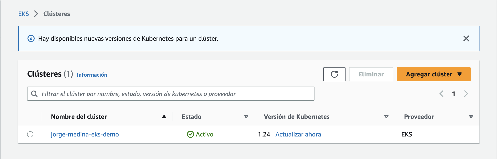

Ahora podemos probar la conexión con kubectl:

```shell
$ kubectl cluster-info
Kubernetes control plane is running at https://7A2C7D429AC069D1D87AE88FF5E915AB.sk1.us-east-1.eks.amazonaws.com
CoreDNS is running at https://7A2C7D429AC069D1D87AE88FF5E915AB.sk1.us-east-1.eks.amazonaws.com/api/v1/namespaces/kube-system/services/kube-dns:dns/proxy

To further debug and diagnose cluster problems, use 'kubectl cluster-info dump'.
```

Después podemos mostrar la información de los nodos del cluster:

```shell
$ kubectl get nodes
NAME                            STATUS   ROLES    AGE     VERSION
ip-192-168-13-95.ec2.internal   Ready    <none>   3m19s   v1.24.10-eks-48e63af
ip-192-168-49-31.ec2.internal   Ready    <none>   3m20s   v1.24.10-eks-48e63af
```

En el módulo `EC2` podemos listar las instancias generadas:

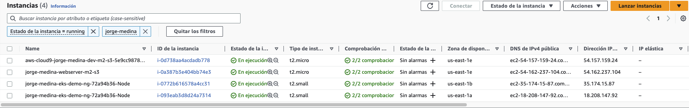

Ahora vamos a crear un deployment con la misma imagen de nginx que usamos en el ejercicio anterior:

```shell
$ kubectl create deployment nginx --image=nginx --port=80 --replicas=2
deployment.apps/nginx created
```

Verificamos :

```shell
$ kubectl get deployments
NAME    READY   UP-TO-DATE   AVAILABLE   AGE
nginx   2/2     2            2           12s
```

Y revisamos los pods:

```shell
$ kubectl get pods
NAME                     READY   STATUS    RESTARTS   AGE
nginx-6c8b449b8f-7982d   1/1     Running   0          43s
nginx-6c8b449b8f-mbz6d   1/1     Running   0          43s
```

Ahora realizaremos un acto de magia, en donde expondremos el despliegue en un puerto, pero de tipo `LoadBalancer`, el cual se conecta a la API de AWS y genera un recurso de tipo `ELB`.

```shell
$ kubectl expose deployment nginx --port 80 --type=LoadBalancer
service/nginx exposed
```

Ahora listamos el service:

```shell
$ kubectl get services
NAME         TYPE           CLUSTER-IP     EXTERNAL-IP                                                               PORT(S)        AGE
kubernetes   ClusterIP      10.100.0.1     <none>                                                                    443/TCP        23m
nginx        LoadBalancer   10.100.29.42   ab514c2013b9f420e92ee06905a01046-1242901687.us-east-1.elb.amazonaws.com   80:30088/TCP   42s
```

Verificamos regresando a la consola de EC2, vamos a balanceadores de carga y dentro encontraremos un ELB multi AZ con una dirección DNS lista para probarse.

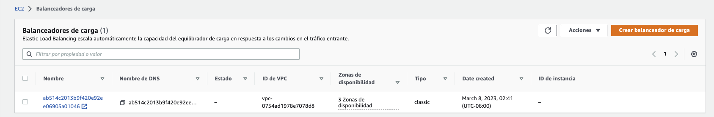

Ahora, copiamos el nombre DNS del balanceador de cargas y lo abrimos en un navegador para verificar que se puede consumir el servicio:


Listo, con esto comprobamos que el servicio de nginx está disponible.

## Limpieza

Es sumamente importante señalar que después de que hemos realizado la actividad de la sesión
y hemos terminado de usar los recursos cloud que creamos es nuestra responsabilidad hacer
una limpieza de los recursos utilizados para no incurrir en más gastos en la cuenta AWS, por
lo que recomendados hacer una limpieza de los recursos.

## Referencias

La siguiente es una lista de referencias que pueden usar para complementar
lo que se expone en esta sesión.

* [Sin servidor en AWS](https://aws.amazon.com/es/serverless/?nc1=h_ls)
* [Amazon Elastic Kubernetes Service (EKS)](https://aws.amazon.com/es/eks/)
* [AWS Eksctl](https://eksctl.io/)
